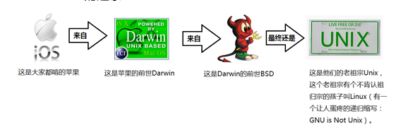
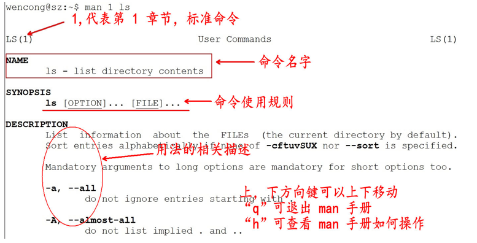
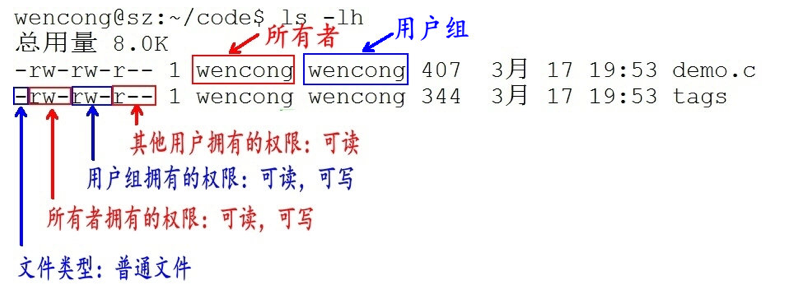

# 操作系统的发展史

## Unix

1965年之前，电脑只有军事或者学院的研究机构碰的起，当时大型主机至多能提供30台终端（30个键盘、显示器)的连接。


1965年左后由贝尔实验室、麻省理工学院 以及 通用电气共同发起了Multics项目，**想让大型主机支持<font color='red'>300</font>台终端**

1969年前后这个项目进度缓慢，资金短缺，贝尔实验室退出了研究

1969年从这个项目中退出的Ken Thompson当时在实验室无聊时，为了让一台空闲的电脑上能够运行“星际旅行”游行，在8月份左右趁着其妻子探亲的时间，用了1个月的时间编写出了 Unix操作系统的原型

1970年，美国贝尔实验室的 Ken Thompson，以 BCPL语言 为基础，设计出很简单且很接近硬件的 B语言（取BCPL的首字母），并且他用B语言写了第一个UNIX操作系统。

因为B语言的跨平台性较差，为了能够在其他的电脑上也能够运行这个非常棒的Unix操作系统，Dennis Ritchie和Ken Thompson 从B语言的基础上准备研究一个更好的语言

1972年，美国贝尔实验室的 Dennis Ritchie在B语言的基础上最终设计出了一种新的语言，他取了BCPL的第二个字母作为这种语言的名字，这就是C语言

1973年初，C语言的主体完成。Thompson和Ritchie迫不及待地开始用它完全重写了现在大名鼎鼎的Unix操作系统

## Minix

因为AT&T(通用电气)的政策改变，在Version 7 Unix推出之后，发布新的使用条款，将UNIX源代码私有化，在大学中不再能使用UNIX源代码。Andrew S. Tanenbaum(塔能鲍姆)教授为了能在课堂上教授学生操作系统运作的实务细节，决定在不使用任何AT&T的源代码前提下，自行开发与UNIX兼容的操作系统，以避免版权上的争议。他以小型UNIX（mini-UNIX）之意，将它称为MINIX。

## Linux

因为Minix只是教学使用，因此功能并不强，因此Torvalds利用GNU的bash当做开发环境，gcc当做编译工具，编写了Linux内核-v0.02，但是一开始Linux并不能兼容Unix，即Unix上跑的应用程序不能在Linux上跑，即应用程序与内核之间的接口不一致，因为Unix是遵循POSIX规范的，因此Torvalds修改了Linux，并遵循POSIX（Portable Operating System Interface，他规范了应用程序与内核的接口规范）； 一开始Linux只适用于386，后来经过全世界的网友的帮助，最终能够兼容多种硬件

## 操作系统的发展




## Minix没有火起来的原因

> Minix的创始人说，MINIX 3没有统治世界是源于他在1992年犯下的一个错误，当时他认为BSD必然会一统天下，因为它是一个更稳定和更成熟的系统，其它操作系统难以与之竞争。因此他的MINIX的重心集中在教育上。四名BSD开发者已经成立了一家公司销售BSD系统，他们甚至还有一个有趣的电话号码1-800-ITS-UNIX。然而他们正因为这个电话号码而惹火上身。美国电话电报公司因电话号码而提起诉讼。官司打了三年才解决。在此期间，BSD陷于停滞，而Linux则借此一飞冲天。他的错误在于没有意识官司竟然持续了如此长的时间，以及BSD会因此受到削弱。如果美国电话电报公司没有起诉，Linux永远不会流行起来，BSD将统治世界。

# Linux介绍

## Linux内核&发行版

### Linux内核版本

内核(kernel)是系统的心脏，是运行程序和管理像磁盘和打印机等硬件设备的核心程序，它提供了一个在裸设备与应用程序间的抽象层。

Linux内核版本又分为稳定版和开发版，两种版本是相互关联，相互循环：

- 稳定版：具有工业级强度，可以广泛地应用和部署。新的稳定版相对于较旧的只是修正一些bug或加入一些新的驱动程序。
- 开发版：由于要试验各种解决方案，所以变化很快。

内核源码网址：http://www.kernel.org 所有来自全世界的对Linux源码的修改最终都会汇总到这个网站，由Linus领导的开源社区对其进行甄别和修改最终决定是否进入到Linux主线内核源码中。

### Linux发行版本

Linux发行版 (也被叫做 GNU/Linux 发行版) 通常包含了包括桌面环境、办公套件、媒体播放器、数据库等应用软件。

目前市面上较知名的发行版有：Ubuntu、RedHat、CentOS、Debian、Fedora、SuSE、OpenSUSE、Arch Linux、SolusOS 等。 


## 类Unix系统目录结构

Unix没有盘符这个概念，只有一个根目录/，所有文件都在它下面


## Linux目录

  

- /：根目录，一般根目录下只存放目录，在Linux下有且只有一个根目录。所有的东西都是从这里开始。当你在终端里输入“/home”，你其实是在告诉电脑，先从/（根目录）开始，再进入到home目录。
- /bin: /usr/bin: 可执行二进制文件的目录，如常用的命令ls、tar、mv、cat等。
- /boot：放置linux系统启动时用到的一些文件，如Linux的内核文件：/boot/vmlinuz，系统引导管理器：/boot/grub。
- /dev：存放linux系统下的设备文件，访问该目录下某个文件，相当于访问某个设备，常用的是挂载光驱 mount /dev/cdrom /mnt。
- /etc：系统配置文件存放的目录，不建议在此目录下存放可执行文件，重要的配置文件有 /etc/inittab、/etc/fstab、/etc/init.d、/etc/X11、/etc/sysconfig、/etc/xinetd.d。
- /home：系统默认的用户家目录，新增用户账号时，用户的家目录都存放在此目录下，~表示当前用户的家目录，~edu 表示用户 edu 的家目录。
- /lib: /usr/lib: /usr/local/lib：系统使用的函数库的目录，程序在执行过程中，需要调用一些额外的参数时需要函数库的协助。
- /lost+fount：系统异常产生错误时，会将一些遗失的片段放置于此目录下。
- /mnt: /media：光盘默认挂载点，通常光盘挂载于 /mnt/cdrom 下，也不一定，可以选择任意位置进行挂载。
- /opt：给主机额外安装软件所摆放的目录。
- /proc：此目录的数据都在内存中，如系统核心，外部设备，网络状态，由于数据都存放于内存中，所以不占用磁盘空间，比较重要的目录有 /proc/cpuinfo、/proc/interrupts、/proc/dma、/proc/ioports、/proc/net/* 等。
- /root：系统管理员root的家目录。
- /sbin: /usr/sbin: /usr/local/sbin：放置系统管理员使用的可执行命令，如fdisk、shutdown、mount 等。与 /bin 不同的是，这几个目录是给系统管理员 root使用的命令，一般用户只能"查看"而不能设置和使用。
- /tmp：一般用户或正在执行的程序临时存放文件的目录，任何人都可以访问，重要数据不可放置在此目录下。
- /srv：服务启动之后需要访问的数据目录，如 www 服务需要访问的网页数据存放在 /srv/www 内。
- /usr：应用程序存放目录，/usr/bin 存放应用程序，/usr/share 存放共享数据，/usr/lib 存放不能直接运行的，却是许多程序运行所必需的一些函数库文件。/usr/local: 存放软件升级包。/usr/share/doc: 系统说明文件存放目录。/usr/share/man: 程序说明文件存放目录。
- /var：放置系统执行过程中经常变化的文件，如随时更改的日志文件 /var/log，/var/log/message：所有的登录文件存放目录，/var/spool/mail：邮件存放的目录，/var/run:程序或服务启动后，其PID存放在该目录下。

## 用户目录

位于/home/user，称之为用户工作目录或家目录,表示方式：

```
/home/user
~
```

从/目录开始描述的路径为**绝对路径**，如：

```
cd /home
ls /usr
```

从当前位置开始描述的路径为**相对路径**，如：

```
cd ../../
ls abc/def
```

每个目录下都有**.和..**

. 表示当前目录

.. 表示上一级目录，即父目录

根目录下的.和..都表示当前目录

| 文件的颜色                            | 含义       |
| ------------------------------------- | ---------- |
| <font color="blue">蓝色</font>        | 目录       |
| <font color="green">绿色</font>       | 可执行文件 |
| <font color="red">红色</font>         | 压缩文件   |
| <font color="lightblue">浅蓝色</font> | 链接文件   |
| <font color="gray">灰色</font>        | 其他文件   |


# 命令行基本操作

## 命令使用方法

Linux命令格式：

```
command  [-options]  [parameter1]  …
```

command: 命令名； [-options]：选项,可用来对命令进行控制，也可以省略，`[]代表可选` parameter1 …：传给命令的参数：可以是零个一个或多个

## 查看帮助文档

### help

一般是linux命令自带的帮助信息

如：ls --help

### man(manual)

man是linux提供的一个手册，包含了绝大部分的命令、函数使用说明

该手册分成很多章节（section），使用man时可以指定不同的章节来浏览。

例：man ls ; man 2 printf

man中各个section意义如下：

1. Standard commands（标准命令）
2. System calls（系统调用，如open,write）
3. Library functions（库函数，如printf,fopen）
4. Special devices（设备文件的说明，/dev下各种设备）
5. File formats（文件格式，如passwd）
6. Games and toys（游戏和娱乐）
7. Miscellaneous（杂项、惯例与协定等，例如Linux档案系统、网络协定、ASCII 码；environ全局变量）
8. Administrative Commands（管理员命令，如ifconfig）

man是按照手册的章节号的顺序进行搜索的。

man设置了如下的功能键：

| 功能键  | 功能                 |
| :-----: | -------------------- |
| 空格键  | 显示手册页的下一屏   |
| Enter键 | 一次滚动手册页的一行 |
|    b    | 回滚一屏             |
|    f    | 前滚一屏             |
|    q    | 退出man命令          |
|    h    | 列出所有功能键       |
|  /word  | 搜索word字符串       |



注意：实际上，我们不用指定第几个章节也用查看，如，man ls

## tab键自动补全

在敲出命令的前几个字母的同时，按下tab键，系统会自动帮我们补全命令

## history游览历史

当系统执行过一些命令后，可按上下键翻看以前的命令，history将执行过的命令列举出来

history保留了最近执行的命令记录，默认可以保留1000。
历史清单从0开始编号到最大值。
常见用法：

```
history N		显示最近N条命令
history -c		清除所有的历史记录
history -w  xxx.txt	保存历史记录到文本xxx.txt
```

## 命令行中的ctrl组合键

Ctrl+c 结束正在运行的程序
Ctrl+d 结束输入或退出shell
Ctrl+s 暂停屏幕输出【锁住终端】
Ctrl+q 恢复屏幕输出【解锁终端】
Ctrl+l 清屏，【是字母L的小写】等同于Clear

当前光标到行首：ctrl+a
当前光标到行尾：ctrl+e
删除当前光标到行首：ctrl+u
删除当前光标到行尾：ctrl+k

Ctrl+y 在光标处粘贴剪切的内容
Ctrl+r 查找历史命令【输入关键字，就能调出以前执行过的命令】
Ctrl+t 调换光标所在处与其之前字符位置，并把光标移到下个字符
Ctrl+x+u 撤销操作
Ctrl+z 转入后台运行

# Linux命令

## 权限管理

### 列出目录的内容：ls

Linux文件或者目录名称最长可以有265个字符，“.”代表当前目录，“..”代表上一级目录，以“.”开头的文件为隐藏文件，需要用 -a 参数才能显示。

ls常用参数：

| 参数 | 含义                                         |
| :--: | -------------------------------------------- |
|  -a  | 显示指定目录下所有子目录与文件，包括隐藏文件 |
|  -l  | 以列表方式显示文件的详细信息                 |
|  -h  | 配合 -l 以人性化的方式显示文件大小           |

```
[root@VM_0_9_centos ~]# ll -h
total 24K
-rw-r--r-- 1 root root 1.6K Dec  1  2016 CentOS7-Base-163.repo.1
-rw-r--r-- 1 root root 6.0K Nov 12  2015 mysql-community-release-el7-5.noarch.rpm
-rw-r--r-- 1 root root   90 Nov 23 10:26 passwd
drwxr-xr-t 2 root root 4.0K Nov 22 21:15 test
-rw-r--r-- 1 root root  276 Nov 24 10:01 user
lrwxrwxrwx 1 root root   14 Nov  6 19:18 web -> /var/www/html/
```

列出的信息的含义：


ls支持通配符：

| 通配符    | 含义                                                         |
| :-------- | :----------------------------------------------------------- |
| *         | 文件代表文件名中所有字符                                     |
| ls te*    | 查找以te开头的文件                                           |
| ls *html  | 查找结尾为html的文件                                         |
| ？        | 代表文件名中任意一个字符                                     |
| ls ?.c    | 只找第一个字符任意，后缀为.c的文件                           |
| ls a.?    | 只找只有3个字符，前2字符为a.，最后一个字符任意的文件         |
| []        | [”和“]”将字符组括起来，表示可以匹配字符组中的任意一个。“-”用于表示字符范围。 |
| [abc]     | 匹配a、b、c中的任意一个                                      |
| [a-f]     | 匹配从a到f范围内的的任意一个字符                             |
| ls [a-f]* | 找到从a到f范围内的的任意一个字符开头的文件                   |
| ls a-f    | 查找文件名为a-f的文件,当“-”处于方括号之外失去通配符的作用    |
| \         | 如果要使通配符作为普通字符使用，可以在其前面加上转义字符。“?”和“*”处于方括号内时不用使用转义字符就失去通配符的作用。 |
| ls \\*a   | 查找文件名为*a的文件                                         |

### 显示inode的内容：stat

```
stat [文件或目录]
```

查看 testfile 文件的inode内容内容，可以用以下命令：

```
[root@VM_0_9_centos ~]# stat mysql-community-release-el7-5.noarch.rpm 
  File: ‘mysql-community-release-el7-5.noarch.rpm’
  Size: 6140            Blocks: 16         IO Block: 4096   regular file
Device: fd01h/64769d    Inode: 394398      Links: 1
Access: (0644/-rw-r--r--)  Uid: (    0/    root)   Gid: (    0/    root)
Access: 2019-11-23 13:30:42.000000000 +0800
Modify: 2015-11-12 15:58:42.000000000 +0800
Change: 2019-11-23 13:30:42.400300171 +0800
 Birth: -

python@ubuntu:~/txt$ stat find我的Mr.Right.txt 
  文件：'find我的Mr.Right.txt'
  大小：64768           块：128        IO 块：4096   普通文件
设备：801h/2049d        Inode：655501      硬链接：1
权限：(0664/-rw-rw-r--)  Uid：( 1000/  python)   Gid：( 1000/  python)
最近访问：2019-11-22 22:43:17.565105155 +0800
最近更改：2019-11-22 22:42:42.000000000 +0800
最近改动：2019-11-22 22:43:08.797116491 +0800
创建时间：-
```

### 文件访问权限

用户能够控制一个给定的文件或目录的访问程度，一个文件或目录可能有读、写及执行权限：

- 读权限（r） ：对于文件，具有读取文件内容的权限；对于目录，具有浏览目录的权限。
- 写权限（w） ：对于文件，具有修改文件内容的权限；对于目录，具有删除、移动目录内文件的权限。
- 可执行权限（x）： 对于文件，具有执行文件的权限；对于目录，该用户具有进入目录的权限。

通常，Unix/Linux系统只允许文件的属主(所有者)或超级用户改变文件的读写权限。

示例：



第1个字母代表文件的类型：

- “d” 代表文件夹
- “-” 代表普通文件
- “c” 代表硬件字符设备
- “b” 代表硬件块设备
- “s”表示管道文件
- “l” 代表软链接文件。

后9个字母分别代表三组权限：文件所有者、用户组、其他用户拥有的权限。

### 修改文件权限：chmod

chmod 修改文件权限有两种使用格式：字母法与数字法。

字母法：chmod u/g/o/a +/-/= rwx 文件

| [ u/g/o/a ] | 含义                                                      |
| :---------- | --------------------------------------------------------- |
| u           | user 表示该文件的所有者                                   |
| g           | group 表示与该文件的所有者属于同一组( group )者，即用户组 |
| o           | other 表示其他以外的人                                    |
| a           | all 表示这三者皆是                                        |

| [ +-= ] | 含义     |
| ------- | -------- |
| +       | 增加权限 |
| -       | 撤销权限 |
| =       | 设定权限 |

| rwx  | 含义                                                         |
| ---- | ------------------------------------------------------------ |
| r    | read 表示可读取，对于一个目录，如果没有r权限，那么就意味着不能通过ls查看这个目录的内容。 |
| w    | write 表示可写入，对于一个目录，如果没有w权限，那么就意味着不能在目录下创建新的文件。 |
| x    | excute 表示可执行，对于一个目录，如果没有x权限，那么就意味着不能通过cd进入这个目录。 |

数字法：“rwx” 这些权限也可以用数字来代替

| 字母 | 说明                         |
| ---- | ---------------------------- |
| r    | 读取权限，数字代号为 "4"     |
| w    | 写入权限，数字代号为 "2"     |
| x    | 执行权限，数字代号为 "1"     |
| -    | 不具任何权限，数字代号为 "0" |

如执行：chmod u=rwx,g=rx,o=r filename 就等同于：chmod u=7,g=5,o=4 filename

chmod 751 file：

- 文件所有者：读、写、执行权限
- 同组用户：读、执行的权限
- 其它用户：执行的权限

chmod 777 file：所有用户拥有读、写、执行权限

注意：如果想递归所有目录加上相同权限，需要加上参数“ -R ”。 如：chmod 777 test/ -R 递归 test 目录下所有文件加 777 权限

### 修改文件所有者：chown

```
python@ubuntu:~/test$ ll h.txt 
-rw------- 1 python python 4 11月 22 22:35 h.txt
python@ubuntu:~/test$ chown mike h.txt 
chown: 正在更改'h.txt' 的所有者: 不允许的操作
python@ubuntu:~/test$ sudo chown mike h.txt 
python@ubuntu:~/test$ ll h.txt              
-rw------- 1 mike python 4 11月 22 22:35 h.txt
```

### 修改文件所属组：chgrp

```
python@ubuntu:~/test$ ll h.txt              
-rw------- 1 mike python 4 11月 22 22:35 h.txt
python@ubuntu:~/test$ sudo chgrp mike h.txt 
python@ubuntu:~/test$ ll h.txt              
-rw------- 1 mike mike 4 11月 22 22:35 h.txt
```

## 文件内容查看

Linux系统中使用以下命令来查看文件的内容：

- cat 由第一行开始显示文件内容
- tac 从最后一行开始显示
- nl  显示的时候，顺道输出行号
- more 一页一页的显示文件内容
- less与more 类似，但可以往前翻页
- head 只看头几行
- tail 只看尾巴几行

### 基本显示：cat、tac

语法：

```
cat [-AbEnTv]
```

选项与参数：

- -A ：相当于 -vET 的整合选项，可列出一些特殊字符而不是空白而已；
- -v ：列出一些看不出来的特殊字符
- -E ：将结尾的断行字节 $ 显示出来；
- -T ：将 [tab] 按键以 ^I 显示出来；
- -b ：列出行号，空白行不标行号
- -n ：列出行号，连同空白行也会有行号

```
[root@VM_0_9_centos ~]# cat -b /etc/issue
     1  \S
     2  Kernel \r on an \m
[root@VM_0_9_centos ~]# cat -n /etc/issue
     1  \S
     2  Kernel \r on an \m
     3
[root@VM_0_9_centos ~]# 
```

tac与cat命令刚好相反，文件内容从最后一行开始显示，可以看出 tac 是 cat 的倒着写！如：

```
[root@VM_0_9_centos ~]# tac /etc/issue
Kernel \r on an \m
\S
```

### 显示行号：nl

语法：

```
nl [-bnw] 文件
```

选项与参数：

- -b ：指定行号指定的方式，主要有两种：
  -b a ：表示不论是否为空行，也同样列出行号(类似 cat -n)；
  -b t ：如果有空行，空的那一行不要列出行号(默认值)；
- -n ：列出行号表示的方法，主要有三种：
  -n ln ：行号在荧幕的最左方显示；
  -n rn ：行号在自己栏位的最右方显示，且不加 0 ；
  -n rz ：行号在自己栏位的最右方显示，且加 0 ；
- -w ：行号栏位的占用的位数。

```
[root@www ~]# nl /etc/issue
     1  CentOS release 6.4 (Final)
     2  Kernel \r on an \m
```

### 分屏显示：more、less

```
[root@www ~]# more /etc/man_db.config 
#
# Generated automatically from man.conf.in by the
# configure script.
#
# man.conf from man-1.6d
....(中间省略)....
--More--(28%)  <== 光标在这里等待命令
```

more运行时可以输入的命令有：

- 空白键 (space)：代表向下翻一页；
- Enter     ：代表向下翻『一行』；
- /字串     ：代表在这个显示的内容当中，向下搜寻『字串』这个关键字；
- :f      ：立刻显示出档名以及目前显示的行数；
- q       ：代表立刻离开 more ，不再显示该文件内容。
- b 或 [ctrl]-b ：代表往回翻页，不过这动作只对文件有用，对管线无用。

```
[root@www ~]# less /etc/man.config
#
# Generated automatically from man.conf.in by the
# configure script.
#
# man.conf from man-1.6d
....(中间省略)....
:   <== 这里可以等待你输入命令！
```

less运行时可以输入的命令有：

- 空白键  ：向下翻动一页；
- [pagedown]：向下翻动一页；
- [pageup] ：向上翻动一页；
- /字串   ：向下搜寻『字串』的功能；
- ?字串   ：向上搜寻『字串』的功能；
- n     ：重复前一个搜寻 (与 / 或 ? 有关！)
- N     ：反向的重复前一个搜寻 (与 / 或 ? 有关！)
- q     ：离开 less 这个程序；

### 取首尾n行：head、tail

head取出文件前面几行

语法：

```
head [-n number] 文件 
```

选项与参数：

- -n ：后面接数字，代表显示几行的意思

```
[root@www ~]# head /etc/man.config
```

默认的情况中，显示前面 10 行！若要显示前 20 行，就得要这样：

```
[root@www ~]# head -n 20 /etc/man.config
```

tail取出文件后面几行

语法：

```
tail [-n number] 文件 
```

选项与参数：

- -n ：后面接数字，代表显示几行的意思
- -f ：表示持续侦测后面所接的档名，要等到按下[ctrl]-c才会结束tail的侦测

```
[root@www ~]# tail /etc/man.config
# 默认的情况中，显示最后的十行！若要显示最后的 20 行，就得要这样：
[root@www ~]# tail -n 20 /etc/man.config
```

## 文件管理

### 输出重定向：>

可将本应显示在终端上的内容保存到指定文件中。

如：ls > test.txt ( test.txt 如果不存在，则创建，存在则覆盖其内容 )

注意： `>输出重定向会覆盖原来的内容，>>输出重定向则会追加到文件的尾部。`

### 管道：|

管道：一个命令的输出可以通过管道做为另一个命令的输入。

“ | ”的左右分为两端，从左端写入到右端。

```
python@ubuntu:/bin$ ll -h |more   
总用量 13M
drwxr-xr-x  2 root root  4.0K 8月   4  2016 ./
drwxr-xr-x 26 root root  4.0K 7月  30  2016 ../
-rwxr-xr-x  1 root root 1014K 6月  24  2016 bash*
-rwxr-xr-x  1 root root   31K 5月  20  2015 bunzip2*
-rwxr-xr-x  1 root root  1.9M 8月  19  2015 busybox*
-rwxr-xr-x  1 root root   31K 5月  20  2015 bzcat*
lrwxrwxrwx  1 root root     6 5月  16  2016 bzcmp -> bzdiff*
-rwxr-xr-x  1 root root  2.1K 5月  20  2015 bzdiff*
lrwxrwxrwx  1 root root     6 5月  16  2016 bzegrep -> bzgrep*
--更多--
```

### 清屏：clear

clear作用为清除终端上的显示(类似于DOS的cls清屏功能)，快捷键：Ctrl + l ( “l” 为字母 )。

### 切换工作目录： cd

`Linux所有的目录和文件名大小写敏感`

cd后面可跟绝对路径，也可以跟相对路径。如果省略目录，则默认切换到当前用户的主目录。

| 命令  | 含义                                   |
| :---- | -------------------------------------- |
| cd    | 相当于cd ~                             |
| cd ~  | 切换到当前用户的主目录(/home/用户目录) |
| cd .  | 切换到当前目录                         |
| cd .. | 切换到上级目录                         |
| cd -  | 进入上次所在的目录                     |

### 显示当前路径：pwd

```bash
python@ubuntu:~$ pwd 
/home/python
```

选项与参数：

- **-P** ：显示出确实的路径，而非使用连结 (link) 路径。

```bash
[root@VM_0_9_centos ~]# cd /var/mail/
[root@VM_0_9_centos mail]# pwd
/var/mail
[root@VM_0_9_centos mail]# pwd -P
/var/spool/mail
```

### 创建目录：mkdir

mkdir可以创建一个新的目录。

注意：新建目录的名称不能与当前目录中已有的目录或文件同名，并且目录创建者必须对当前目录具有写权限。

语法：

```
mkdir [-mp] 目录名称
```

选项与参数：

- -m ：指定被创建目录的权限，而不是根据默认权限 (umask) 设定
- -p ：递归创建所需要的目录

实例：-p递归创建目录：

```
[root@www ~]# cd /tmp
[root@www tmp]# mkdir test    <==创建一名为 test 的新目录
[root@www tmp]# mkdir test1/test2/test3/test4
mkdir: cannot create directory `test1/test2/test3/test4': 
No such file or directory       <== 没办法直接创建此目录啊！
[root@www tmp]# mkdir -p test1/test2/test3/test4
```

mkdir创建的目录权限默认根据umask得到，而-m参数可以指定被创建目录的权限：

```
[root@VM_0_9_centos ~]# mkdir t1
[root@VM_0_9_centos ~]# ll
drwxr-xr-x 2 root root 4096 Nov 22 18:54 t1
[root@VM_0_9_centos ~]# mkdir t2 -m 711 
[root@VM_0_9_centos ~]# ll
drwxr-xr-x 2 root root 4096 Nov 22 18:54 t1
drwx--x--x 2 root root 4096 Nov 22 18:54 t2
```

### 删除文件：rm

可通过rm删除文件或目录。使用rm命令要小心，因为文件删除后不能恢复。为了防止文件误删，可以在rm后使用-i参数以逐个确认要删除的文件。

常用参数及含义如下表所示：

| 参数 | 含义                                             |
| :--- | ------------------------------------------------ |
| -i   | 以进行交互式方式执行                             |
| -f   | 强制删除，忽略不存在的文件，无需提示             |
| -r   | 递归地删除目录下的内容，删除文件夹时必须加此参数 |

### 建立链接文件：ln

软链接：ln -s 源文件 链接文件

硬链接：ln 源文件 链接文件

软链接类似于Windows下的快捷方式，如果软链接文件和源文件不在同一个目录，源文件要使用绝对路径，不能使用相对路径。

硬链接只能链接普通文件不能链接目录。 两个文件占用相同大小的硬盘空间，即使删除了源文件，链接文件还是存在，所以-s选项是更常见的形式。

### 文本搜索：grep

Linux系统中grep命令是一种强大的文本搜索工具，grep允许对文本文件进行模式查找。如果找到匹配模式， grep打印包含模式的所有行。

grep一般格式为：

```
grep [-选项] '搜索内容串' 文件名
```

在grep命令中输入字符串参数时，最好引号或双引号括起来。例如：`grep 'a' 1.txt`。

在当前目录中，查找前缀有test字样的文件中包含 test 字符串的文件，并打印出该字符串的行。此时，可以使用如下命令：

```
$ grep test test* #查找前缀有test的文件包含test字符串的文件  
testfile1:This a Linux testfile! #列出testfile1 文件中包含test字符的行  
testfile_2:This is a linux testfile! #列出testfile_2 文件中包含test字符的行  
testfile_2:Linux test #列出testfile_2 文件中包含test字符的行 
```

以递归的方式查找符合条件的文件。例如，查找指定目录/etc/acpi 及其子目录（如果存在子目录的话）下所有文件中包含字符串"update"的文件，并打印出该字符串所在行的内容，使用的命令为：

```
$ grep -r update /etc/acpi #以递归的方式查找“etc/acpi”  
#下包含“update”的文件  
/etc/acpi/ac.d/85-anacron.sh:# (Things like the slocate updatedb cause a lot of IO.)  
Rather than  
/etc/acpi/resume.d/85-anacron.sh:# (Things like the slocate updatedb cause a lot of  
IO.) Rather than  
/etc/acpi/events/thinkpad-cmos:action=/usr/sbin/thinkpad-keys--update 
```

反向查找。前面各个例子是查找并打印出符合条件的行，通过"-v"参数可以打印出不符合条件行的内容。

查找文件名中包含 test 的文件中不包含test 的行，此时，使用的命令为：

```
$ grep -v test* #查找文件名中包含test 的文件中不包含test 的行  
testfile1:helLinux!  
testfile1:Linis a free Unix-type operating system.  
testfile1:Lin  
testfile_1:HELLO LINUX!  
testfile_1:LINUX IS A FREE UNIX-TYPE OPTERATING SYSTEM.  
testfile_1:THIS IS A LINUX TESTFILE!  
testfile_2:HELLO LINUX!  
testfile_2:Linux is a free unix-type opterating system.  
```

### 查找文件：find

常用用法：

| 命令                        | 含义                                   |
| :-------------------------- | -------------------------------------- |
| find ./ -name test.sh       | 查找当前目录下所有名为test.sh的文件    |
| find ./ -name '*.sh'        | 查找当前目录下所有后缀为.sh的文件      |
| find ./ -name "[A-Z]*"      | 查找当前目录下所有以大写字母开头的文件 |
| find /tmp -size 2M          | 查找在/tmp 目录下等于2M的文件          |
| find /tmp -size +2M         | 查找在/tmp 目录下大于2M的文件          |
| find /tmp -size -2M         | 查找在/tmp 目录下小于2M的文件          |
| find ./ -size +4k -size -5M | 查找当前目录下大于4k，小于5M的文件     |
| find ./ -perm 0777          | 查找当前目录下权限为 777 的文件或目录  |

Linux find命令用来在指定目录下查找文件。任何位于参数之前的字符串都将被视为欲查找的目录名。如果使用该命令时，不设置任何参数，则find命令将在当前目录下查找子目录与文件。并且将查找到的子目录和文件全部进行显示。

语法：

```
find path -option [ -print ] [ -exec -ok command ] {} \;
```

**常用参数说明** :

- -perm xxxx：权限为 xxxx的文件或目录
- -user： 按照文件属主来查找文件。
- -size n : n单位,b:512位元组的区块,c:字元数,k:kilo bytes,w:二个位元组
- -mount, -xdev : 只检查和指定目录在同一个文件系统下的文件，避免列出其它文件系统中的文件
- -amin n : 在过去 n 分钟内被读取过
- -anewer file : 比文件 file 更晚被读取过的文件
- -atime n : 在过去n天内被读取过的文件
- -cmin n : 在过去 n 分钟内被修改过
- -cnewer file :比文件 file 更新的文件
- -ctime n : 在过去n天内被修改过的文件
- -empty : 空的文件
- -gid n or -group name : gid 是 n 或是 group 名称是 name
- -ipath p, -path p : 路径名称符合 p 的文件，ipath 会忽略大小写
- -name name, -iname name : 文件名称符合 name 的文件。iname 会忽略大小写
- -type 查找某一类型的文件：
  - b - 块设备文件
  - d - 目录
  - c - 字符设备文件
  - p - 管道文件
  - l - 符号链接文件
  - f - 普通文件
- -exec 命令名{} \ (注意：“}”和“\”之间有空格)

find实例：

显示当前目录中大于20字节并以.c结尾的文件名

```
# find . -name "*.c" -size +20c 
```

将目前目录其其下子目录中所有一般文件列出

```
# find . -type f
```

将目前目录及其子目录下所有最近 20 天内更新过的文件列出

```
# find . -ctime -20
```

查找/var/log目录中更改时间在7日以前的普通文件，并在删除之前询问它们：

```
# find /var/log -type f -mtime +7 -ok rm {} \;
```

查找前目录中文件属主具有读、写权限，并且文件所属组的用户和其他用户具有读权限的文件：

```
# find . -type f -perm 644 -exec ls -l {} \;
```

查找系统中所有文件长度为0的普通文件，并列出它们的完整路径：

```
# find / -type f -size 0 -exec ls -l {} \;
```

从根目录查找类型为符号链接的文件，并将其删除：

```
find / -type l -exec rm -rf {} \
```

从当前目录查找用户tom的所有文件并显示在屏幕上

```
find . -user tom
```

在当前目录中查找所有文件以.doc结尾，且更改时间在3天以上的文件，找到后删除，并且给出删除提示

```
find . -name *.doc  -mtime +3 -ok rm {} \;
```

在当前目录下查找所有链接文件，并且以长格式显示文件的基本信息

```
find . -type l -exec ls -l {} \;
```

在当前目录下查找文件名有一个小写字母、一个大写字母、两个数字组成，且扩展名为.doc的文件

```
find . -name '[a-z][A-Z][0-9][0-9].doc'
```

### 拷贝文件：cp

cp命令的功能是将给出的文件或目录复制到另一个文件或目录中，相当于DOS下的copy命令。

常用选项说明：

| 选项 | 含义                                                         |
| :--- | ------------------------------------------------------------ |
| -a   | 该选项通常在复制目录时使用，它保留链接、文件属性，并递归地复制目录，简单而言，保持文件原有属性。 |
| -f   | 已经存在的目标文件而不提示                                   |
| -i   | 交互式复制，在覆盖目标文件之前将给出提示要求用户确认         |
| -r   | 若给出的源文件是目录文件，则cp将递归复制该目录下的所有子目录和文件，目标文件必须为一个目录名。 |
| -v   | 显示拷贝进度                                                 |
| -l   | 创建硬链接(hard link)，而非复制文件本身                      |
| -s   | 复制成为符号链接 (symbolic link)，相当于批量创建快捷方式     |
| -u   | 若 destination 比 source 旧才升级 destination ！             |

cp vim_configure/ code/ -ivr 把文件夹 vim_configure 拷贝到 code 目录里：

### 移动文件：mv

mv命令用来移动文件或目录，也可以给文件或目录重命名。

常用选项说明：

| 选项 | 含义                                                         |
| :--- | ------------------------------------------------------------ |
| -f   | 禁止交互式操作，如有覆盖也不会给出提示                       |
| -i   | 确认交互方式操作，如果mv操作将导致对已存在的目标文件的覆盖，系统会询问是否重写，要求用户回答以避免误覆盖文件 |
| -v   | 显示移动进度                                                 |

### 归档管理：tar

此命令可以把一系列文件归档到一个大文件中，也可以把档案文件解开以恢复数据。

tar使用格式 tar [参数] 打包文件名 文件

tar命令参数很特殊，其参数前面可以使用“-”，也可以不使用。

常用参数：

| 参数 | 含义                                                      |
| :--- | --------------------------------------------------------- |
| -c   | 生成档案文件，创建打包文件                                |
| -v   | 列出归档解档的详细过程，显示进度                          |
| -f   | 指定档案文件名称，f后面一定是.tar文件，所以必须放选项最后 |
| -t   | 列出档案中包含的文件                                      |
| -x   | 解开档案文件                                              |

注意：除了f需要放在参数的最后，其它参数的顺序任意。

```bash
python@ubuntu:~/test$ tar -cvf test.tar 1.txt 2.txt 3.txt 
1.txt
2.txt
3.txt
python@ubuntu:~/test$ ll
总用量 32
drwxrwxr-x  2 python python  4096 11月 21 14:02 ./
drwxr-xr-x 31 python python  4096 11月 21 13:34 ../
-rw-rw-r--  1 python python    51 1月  20  2017 1.txt
-rw-rw-r--  1 python python    55 1月  20  2017 2.txt
-rw-rw-r--  1 python python    51 1月  20  2017 3.txt
-rw-rw-r--  1 python python 10240 11月 21 14:02 test.tar
python@ubuntu:~/test$ rm -rf *.txt
python@ubuntu:~/test$ ll
总用量 20
drwxrwxr-x  2 python python  4096 11月 21 14:03 ./
drwxr-xr-x 31 python python  4096 11月 21 13:34 ../
-rw-rw-r--  1 python python 10240 11月 21 14:02 test.tar
python@ubuntu:~/test$ tar -xvf test.tar 
1.txt
2.txt
3.txt
python@ubuntu:~/test$ ls *.txt
1.txt  2.txt  3.txt
```

### 文件压缩解压：gzip、bzip2

tar与gzip命令结合使用实现文件打包、压缩。 tar只负责打包文件，但不压缩，用gzip压缩tar打包后的文件，其扩展名一般用xxxx.tar.gz。

gzip使用格式如下：

```
gzip  [选项]  被压缩文件
```

常用选项：

| 选项 | 含义     |
| ---- | -------- |
| -d   | 解压文件 |
| -r   | 压缩文件 |

```
python@ubuntu:~/test$ ll *.tar*
-rw-rw-r-- 1 python python 10240 11月 25 07:39 test.tar
python@ubuntu:~/test$ gzip -r test.tar test.tar.gz  ==>或者:gzip test.tar
python@ubuntu:~/test$ ll *.tar*
-rw-rw-r-- 1 python python 139 11月 25 07:39 test.tar.gz
python@ubuntu:~/test$ gzip -d test.tar.gz
python@ubuntu:~/test$ ll *.tar*  
-rw-rw-r-- 1 python python 10240 11月 25 07:39 test.tar
```

tar命令中-z选项可以调用gzip实现了一个压缩的功能，实行一个先打包后压缩的过程。

压缩用法：tar zcvf 压缩包包名 文件1 文件2 ...

例如： tar zcvf test.tar.gz 1.c 2.c 3.c 4.c把 1.c 2.c 3.c 4.c 压缩成 test.tar.gz

```
python@ubuntu:~/test/code$ ls
1.c  2.c  3.c  4.c
python@ubuntu:~/test/code$ tar zcvf test.tar.gz 1.c 2.c 3.c 4.c 

python@ubuntu:~/test/code$ ls
1.c  2.c  3.c  4.c  test.tar.gz
python@ubuntu:~/test/code$ tar -zcvf new.tar.gz 1.c 2.c 3.c 4.c        

python@ubuntu:~/test/code$ ls
1.c  2.c  3.c  4.c  new.tar.gz  test.tar.gz
```

解压用法： tar zxvf 压缩包包名

例如：

```
python@ubuntu:~/test/code$ ls
new.tar.gz  test.tar.gz
python@ubuntu:~/test/code$ tar zxvf new.tar.gz 
1.c
2.c
3.c
4.c
python@ubuntu:~/test/code$ ls
1.c  2.c  3.c  4.c  new.tar.gz  test.tar.gz
```

解压到指定目录：-C （解压时可以不指定-z选项）

```
python@ubuntu:~/test/code$ ls number/     
python@ubuntu:~/test/code$ tar xvf test.tar.gz -C number/     

python@ubuntu:~/test/code$ ls number/                    
1.c  2.c  3.c  4.c
```

bzip2命令跟gzip用法类似

压缩用法：tar jcvf 压缩包包名 文件...(tar jcvf bk.tar.bz2 *.c)

解压用法：tar jxvf 压缩包包名 (tar jxvf bk.tar.bz2)

### 文件压缩解压：zip、unzip

通过zip压缩文件的目标文件不需要指定扩展名，默认扩展名为zip。

压缩文件：zip [-r] 目标文件(没有扩展名) 源文件

解压文件：unzip -d 解压后目录文件 压缩文件

```
python@ubuntu:~/test$ ls
1.txt  2.txt  3.txt  test.tar
python@ubuntu:~/test$ zip myzip *.txt
  adding: 1.txt (stored 0%)
  adding: 2.txt (stored 0%)
  adding: 3.txt (stored 0%)
python@ubuntu:~/test$ ls
1.txt  2.txt  3.txt  myzip.zip  test.tar
python@ubuntu:~/test$ rm -f *.txt *.tar
python@ubuntu:~/test$ ls
myzip.zip
python@ubuntu:~/test$ unzip myzip.zip 
Archive:  myzip.zip
 extracting: 1.txt                   
 extracting: 2.txt                   
 extracting: 3.txt                   
python@ubuntu:~/test$ ls
1.txt  2.txt  3.txt  myzip.zip
python@ubuntu:~/test$ unzip -d dir myzip.zip 
Archive:  myzip.zip
 extracting: dir/1.txt               
 extracting: dir/2.txt               
 extracting: dir/3.txt               
python@ubuntu:~/test$ ls
1.txt  2.txt  3.txt  dir  myzip.zip
```

### 查看命令位置：which

```
python@ubuntu:~$ which ls
/bin/ls
python@ubuntu:~$ which sudo
/usr/bin/sudo
```

## 用户和用户组管理

用户管理包括用户与组账号的管理。

在Unix/Linux系统中，不论是由本机或是远程登录系统，每个系统都必须拥有一个账号，并且对于不同的系统资源拥有不同的使用权限。

Unix/Linux系统中的root账号通常用于系统的维护和管理，它对Unix/Linux操作系统的所有部分具有不受限制的访问权限。

在Unix/Linux安装的过程中，系统会自动创建许多用户账号，而这些默认的用户就称为“标准用户”。

在大多数版本的Unix/Linux中，都不推荐直接使用root账号登录系统。

### 查看当前用户：whoami

查看当前系统当前账号的用户名。可通过cat /etc/passwd查看系统用户信息。

```bash
python@ubuntu:~/test$ whoami
python
```

### 查看登录用户：who

who命令用于查看当前所有登录系统的用户信息。

常用选项：

| 选项          | 含义                                               |
| :------------ | -------------------------------------------------- |
| -m或am I      | 只显示运行who命令的用户名、登录终端和登录时间      |
| -q或--count   | 只显示用户的登录账号和登录用户的数量               |
| -u            | 在登录时间后显示该用户最后一次操作到当前的时间间隔 |
| -u或--heading | 显示列标题                                         |

### 退出登录账户： exit

如果是图形界面，退出当前终端；

如果是使用ssh远程登录，退出登陆账户；

如果是切换后的登陆用户，退出则返回上一个登陆账号。

### 添加用户账号：useradd

在Unix/Linux中添加用户账号可以使用adduser或useradd命令，因为adduser命令是指向useradd命令的一个链接，因此，这两个命令的使用格式完全一样。

useradd命令的使用格式如下： useradd [参数] 新建用户账号

| 参数 | 含义                                                         |
| :--- | ------------------------------------------------------------ |
| -d   | 指定用户登录系统时的主目录                                   |
| -m   | 自动建立目录，未指定-d参数时会在/home/{当前用户}目录下建立主目录 |
| -g   | 指定组名称                                                   |

相关说明：

- Linux每个用户都要有一个主目录，主目录就是第一次登陆系统，用户的默认当前目录(/home/用户)；
- 每一个用户必须有一个主目录，所以用useradd创建用户的时候，一定给用户指定一个主目录；
- 如果创建用户的时候，不指定组名，那么系统会自动创建一个和用户名一样的组名。

若创建用户时未指定家目录，后期可通过`usermod -d /home/abc abc`指定

| 命令                            | 含义                                                         |
| :------------------------------ | ------------------------------------------------------------ |
| useradd -d /home/abc abc -m     | 创建abc用户，如果/home/abc目录不存在，就自动创建这个目录，同时用户属于abc组 |
| useradd -d /home/a a -g test -m | 创建一个用户名字叫a，主目录在/home/a，如果主目录不存在，就自动创建主目录，同时用户属于test组 |
| cat /etc/passwd                 | 查看系统当前用户名                                           |

### 修改用户：usermod

常用的选项包括`-c, -d, -m, -g, -G, -s, -u以及-o等`，这些选项的意义与`useradd`命令中的选项一样，可以为用户指定新的资源值 。

修改用户所在组：usermod -g 用户组 用户名

```
usermod -g test abc
```

改abc用户的家目录位置：usermod -d 家目录 用户名

```
usermod -d /home/abc abc
```

选项`-l 新用户名`指定一个新的账号，可修改用户名：

```
python@ubuntu:~/txt$ tail /etc/passwd -n 1 
aaa:x:1001:1001::/home/aaa:
python@ubuntu:~/txt$ sudo usermod -l bbb -d /home/bbb aaa   
python@ubuntu:~/txt$ tail /etc/passwd -n 1               
bbb:x:1001:1001::/home/bbb:
```

### 设置用户密码：passwd

超级用户可以为自己和其他用户指定口令，普通用户只能用它修改自己的口令。命令的格式为：

```
passwd 选项 用户名
```

可使用的选项：

- -l 锁定口令，即禁用账号。
- -u 口令解锁。
- -d 使账号无口令。
- -f 强迫用户下次登录时修改口令。

假设当前用户是sam，则下面的命令修改该用户自己的口令：

```
$ passwd 
Old password:****** 
New password:******* 
Re-enter new password:*******
```

如果是超级用户，可以用下列形式指定任何用户的口令：

```
# passwd sam 
New password:******* 
Re-enter new password:*******
```

普通用户修改自己的口令时，passwd命令会先询问原口令，验证后再要求用户输入两遍新口令，如果两次输入的口令一致，则将这个口令指定给用户；而超级用户为用户指定口令时，就不需要知道原口令。

为用户指定空口令时，执行下列形式的命令：

```
# passwd -d sam
```

此命令将用户 sam 的口令删除，这样用户 sam 下一次登录时，系统就不再允许该用户登录了。

passwd 命令还可以用 -l(lock) 选项锁定某一用户，使其不能登录，例如：

```
# passwd -l sam
```

### 删除用户：userdel

| 命令                   | 含义                                    |
| :--------------------- | --------------------------------------- |
| userdel abc(用户名)    | 删除abc用户，但不会自动删除用户的主目录 |
| userdel -r abc(用户名) | 删除用户，同时删除用户的主目录          |

### 切换用户：su

su后面可以加“-”会将当前的工作目录自动转换到切换后的用户主目录.

| 命令          | 含义                                       |
| :------------ | ------------------------------------------ |
| su            | 切换到root用户                             |
| su root       | 切换到root用户                             |
| su -          | 切换到root用户，同时切换目录到/root        |
| su - root     | 切换到root用户，同时切换目录到/root        |
| su 普通用户   | 切换到普通用户                             |
| su - 普通用户 | 切换到普通用户，同时切换普通用户所在的目录 |

注意：对于ubuntu平台，只能通过sudo su进入root账号。

sudo允许系统管理员让普通用户执行一些或者全部的root命令的一个工具。

### 以root身份执行指令：sudo

sudo命令可以临时获取root权限

使用权限：在 /etc/sudoers 中有出现的使用者。

```
显示出自己（执行 sudo 的使用者）的权限
sudo -l
以root权限执行上一条命令
sudo !!
```

sudoers文件配置语法

```
user  MACHINE=COMMANDS
用户 登录的主机=（可以变换的身份） 可以执行的命令  
```

例子：

```
允许root用户执行任意路径下的任意命令 
root    ALL=(ALL)       ALL
允许wheel用户组中的用户执行所有命令  
%wheel        ALL=(ALL)       ALL
允许wheel用户组中的用户在不输入该用户的密码的情况下使用所有命令
%wheel        ALL=(ALL)       NOPASSWD: ALL
允许support用户在EPG的机器上不输入密码的情况下使用SQUID中的命令
Cmnd_Alias   SQUID = /opt/vtbin/squid_refresh, /sbin/service, /bin/rm
Host_Alias   EPG = 192.168.1.1, 192.168.1.2
support EPG=(ALL) NOPASSWD: SQUID
```


### 添加、删除组账号：groupadd、groupdel

groupadd 新建组账号 groupdel 组账号 cat /etc/group 查看用户组

```
python@ubuntu:~/test$ sudo groupadd abc
python@ubuntu:~/test$ sudo groupdel abc
python@ubuntu:~/test$ sudo groupdel abc
groupdel：“abc”组不存在
```

### 用户组管理：groupmod

修改用户组的属性使用groupmod命令。其语法如下：

```
groupmod 选项 用户组
```

常用的选项有：

- -g GID 为用户组指定新的组标识号。
- -o 与-g选项同时使用，用户组的新GID可以与系统已有用户组的GID相同。
- -n新用户组 将用户组的名字改为新名字

将组group2的组标识号修改为102：

```
# groupmod -g 102 group2
```

将组group2的标识号改为10000，组名修改为group3：

```
# groupmod –g 10000 -n group3 group2
```

如果一个用户同时属于多个用户组，那么用户可以在用户组之间切换，以便具有其他用户组的权限。

用户可以在登录后，使用命令newgrp切换到其他用户组，这个命令的参数就是目的用户组。例如：

```
$ newgrp root
```

这条命令将当前用户切换到root用户组，前提条件是root用户组确实是该用户的主组或附加组。类似于用户账号的管理，用户组的管理也可以通过集成的系统管理工具来完成。

## 系统管理

### 查看当前日历：cal

cal命令用于查看当前日历，-y显示整年日历：

```bash
python@ubuntu:~$ cal
      十一月 2019        
日 一 二 三 四 五 六  
                1  2  
 3  4  5  6  7  8  9  
10 11 12 13 14 15 16  
17 18 19 20 21 22 23  
24 25 26 27 28 29 30 
```

### 显示或设置时间：date

设置时间格式（需要管理员权限）：

```
date [MMDDhhmm[[CC]YY][.ss]] +format
```

MM为月，DD为天，hh为小时，mm为分钟；CC为年前两位，YY为年的后两位，ss为秒。

如： date 010203042016.55。

显示时间格式（date '+%y,%m,%d,%H,%M,%S'）：

| format格式 | 含义 |
| :--------- | ---- |
| %Y，%y     | 年   |
| %m         | 月   |
| %d         | 日   |
| %H         | 时   |
| %M         | 分   |
| %S         | 秒   |


### 查看网络状态：netstat

netstat命令用于显示网络状态。

利用netstat指令可让你得知整个Linux系统的网络情况。

语法：

```
netstat [-acCeFghilMnNoprstuvVwx][-A<网络类型>][--ip]
```

**参数说明**：

- -a或--all 显示所有连线中的Socket。
- -A<网络类型>或--<网络类型> 列出该网络类型连线中的相关地址。
- -c或--continuous 持续列出网络状态。
- -C或--cache 显示路由器配置的快取信息。
- -e或--extend 显示网络其他相关信息。
- -F或--fib 显示FIB。
- -g或--groups 显示多重广播功能群组组员名单。
- -h或--help 在线帮助。
- -i或--interfaces 显示网络界面信息表单。
- -l或--listening 显示监控中的服务器的Socket。
- -M或--masquerade 显示伪装的网络连线。
- -n或--numeric 直接使用IP地址，而不通过域名服务器。
- -N或--netlink或--symbolic 显示网络硬件外围设备的符号连接名称。
- -o或--timers 显示计时器。
- -p或--programs 显示正在使用Socket的程序识别码和程序名称。
- -r或--route 显示Routing Table。
- -s或--statistice 显示网络工作信息统计表。
- -t或--tcp 显示TCP传输协议的连线状况。
- -u或--udp 显示UDP传输协议的连线状况。
- -v或--verbose 显示指令执行过程。
- -V或--version 显示版本信息。
- -w或--raw 显示RAW传输协议的连线状况。
- -x或--unix 此参数的效果和指定"-A unix"参数相同。
- --ip或--inet 此参数的效果和指定"-A inet"参数相同。

常用：

```
[root@VM_0_9_centos ~]# netstat -nltp
Active Internet connections (only servers)
Proto Recv-Q Send-Q Local Address  Foreign Address  State   PID/Program name
tcp        0      0    0.0.0.0:22    0.0.0.0:*      LISTEN   3308/sshd
tcp6       0      0         :::80         :::*      LISTEN   4624/httpd
```

### 查看进程信息：ps

进程是一个具有一定独立功能的程序，它是操作系统动态执行的基本单元。

ps命令选项
ps a 	显示现行终端机下的所有程序，包括其他用户的程序。
ps -A 	显示所有程序。
ps c 	列出程序时，显示每个程序真正的指令名称，而不包含路		径，参数或常驻服务的标示。
ps -e 	此参数的效果和指定"A"参数相同。
ps e 	列出程序时，显示每个程序所使用的环境变量。
ps f 	用ASCII字符显示树状结构，表达程序间的相互关系。
ps -H 	显示树状结构，表示程序间的相互关系。
ps -N 	显示所有的程序，除了执行ps指令终端机下的程序之外。
ps s 	采用程序信号的格式显示程序状况。
ps u	以用户为主的格式来显示程序状况。
ps x	显示所有程序，不以终端机来区分。

| 选项 | 含义                                     |
| :--- | ---------------------------------------- |
| -a   | 显示终端上的所有进程，包括其他用户的进程 |
| -u   | 显示进程的详细状态                       |
| -x   | 显示没有控制终端的进程                   |
| -w   | 显示加宽，以便显示更多的信息             |
| -r   | 只显示正在运行的进程                     |

常见用法
ps -e			查看所有进程信息（瞬时的）
ps -u root -N		查看所有不是root运行的进程
ps ax			显示所有进程状态状态
ps -ef |grep xxx	显示含有xxx的进程

实例：

```
# ps -A 显示进程信息
PID TTY     TIME CMD
  1 ?    00:00:02 init
  2 ?    00:00:00 kthreadd
……省略部分结果
30749 pts/0  00:00:15 gedit
30886 ?    00:01:10 qtcreator.bin
30894 ?    00:00:00 qtcreator.bin 
```

显示指定用户信息

```
# ps -u root //显示root进程用户信息
 PID TTY     TIME CMD
  1 ?    00:00:02 init
  2 ?    00:00:00 kthreadd
  3 ?    00:00:00 migration/0
……省略部分结果
30487 ?    00:00:06 gnome-terminal
30488 ?    00:00:00 gnome-pty-helpe
30489 pts/0  00:00:00 bash
```

显示所有进程信息，连同命令行

```
# ps -ef //显示所有命令，连带命令行
UID    PID PPID C STIME TTY     TIME CMD
root     1   0 0 10:22 ?    00:00:02 /sbin/init
root     2   0 0 10:22 ?    00:00:00 [kthreadd]
root     3   2 0 10:22 ?    00:00:00 [migration/0]
root     4   2 0 10:22 ?    00:00:00 [ksoftirqd/0]
root     5   2 0 10:22 ?    00:00:00 [watchdog/0]
root     6   2 0 10:22 ?    /usr/lib/NetworkManager
……省略部分结果
root   31302 2095 0 17:42 ?    00:00:00 sshd: root@pts/2 
root   31374 31302 0 17:42 pts/2  00:00:00 -bash
root   31400   1 0 17:46 ?    00:00:00 /usr/bin/python /usr/sbin/aptd
root   31407 31374 0 17:48 pts/2  00:00:00 ps -ef
```

### 以树状图显示进程关系：pstree

显示进程的关系

```
pstree
init-+-amd
|-apmd
|-atd
|-httpd---10*[httpd]
%pstree -p
init(1)-+-amd(447)
|-apmd(105)
|-atd(339)
%pstree -c
init-+-amd
|-apmd
|-atd
|-httpd-+-httpd
| |-httpd
| |-httpd
| |-httpd
....
```

特别表明在运行的进程

```
# pstree -apnh //显示进程间的关系
```

同时显示用户名称

```
# pstree -u //显示用户名称
```

### 动态显示进程：top

top命令用来动态显示运行中的进程。top命令能够在运行后，在指定的时间间隔更新显示信息。-d参数可以指定显示信息更新的时间间隔。

在top命令执行后，可以按下按键得到对显示的结果进行排序：

| 按键 | 含义                               |
| :--- | ---------------------------------- |
| M    | 根据内存使用量来排序               |
| P    | 根据CPU占有率来排序                |
| T    | 根据进程运行时间的长短来排序       |
| U    | 可以根据后面输入的用户名来筛选进程 |
| K    | 可以根据后面输入的PID来杀死进程。  |
| q    | 退出                               |
| h    | 获得帮助                           |

```bash
python@ubuntu:~$ top
top - 08:31:54 up 2 min,  1 user,  load average: 0.25, 0.37, 0.17
Tasks: 271 total,   1 running, 270 sleeping,   0 stopped,   0 zombie
%Cpu(s):  0.2 us,  0.0 sy,  0.0 ni, 99.8 id,  0.0 wa,  0.0 hi,  0.0 si,  0.0 st
KiB Mem :  4028880 total,  3210104 free,   331668 used,   487108 buff/cache
KiB Swap:  4192252 total,  4192252 free,        0 used.  3414856 avail Mem 

   PID USER      PR  NI    VIRT    RES    SHR S  %CPU %MEM     TIME+ COMMAND    
  4827 redis     20   0   47204   6632   2300 S   0.3  0.2   0:00.21 redis-ser+ 
  6371 python    20   0   49000   3896   3176 R   0.3  0.1   0:00.12 top        
     1 root      20   0  119940   6112   4004 S   0.0  0.2   0:02.77 systemd    
     2 root      20   0       0      0      0 S   0.0  0.0   0:00.02 kthreadd   
     3 root      20   0       0      0      0 S   0.0  0.0   0:00.11 ksoftirqd+ 
```

更高级的命令是htop，但需要安装：

```
[root@VM_0_9_centos ~]# htop

  CPU[||                                                              1.3%]   Tasks: 55, 29 thr; 1 running
  Mem[||||||||||||||||||||||||||||||||||||||||||||||||||||||||||184M/1.80G]   Load average: 0.00 0.01 0.05 
  Swp[                                                               0K/0K]   Uptime: 42 days, 03:29:48

  PID USER      PRI  NI  VIRT   RES   SHR S CPU% MEM%   TIME+  Command
 2609 root       20   0  156M  9132  1784 S  0.7  0.5 39:01.13 barad_agent
 2610 root       20   0  660M 14168  1976 S  0.7  0.8  3h35:20 barad_agent
 1158 root       20   0  120M  2576  1492 R  0.0  0.1  0:00.01 htop
```


### 终止进程：kill

kill命令指定进程号的进程，需要配合 ps 使用。

使用格式：

```
kill [-signal] pid
```

信号值从0到15，其中9为绝对终止，可以处理一般信号无法终止的进程。

### 关机重启：reboot、shutdown、init

| 命令              | 含义                                       |
| :---------------- | ------------------------------------------ |
| reboot            | 重新启动操作系统                           |
| shutdown –r now   | 重新启动操作系统，shutdown会给别的用户提示 |
| shutdown -h now   | 立刻关机，其中now相当于时间为0的状态       |
| shutdown -h 20:25 | 系统在今天的20:25 会关机                   |
| shutdown -h +10   | 系统再过十分钟后自动关机                   |
| init 0            | 关机                                       |
| init 6            | 重启                                       |

### 检测磁盘空间：df

df命令用于检测文件系统的磁盘空间占用和空余情况，可以显示所有文件系统对节点和磁盘块的使用情况。

| 选项 | 含义                                 |
| :--- | ------------------------------------ |
| -a   | 显示所有文件系统的磁盘使用情况       |
| -m   | 以1024字节为单位显示                 |
| -t   | 显示各指定文件系统的磁盘空间使用情况 |
| -T   | 显示文件系统                         |

```bash
python@ubuntu:~/test$ df -Th
文件系统       类型      容量  已用  可用 已用% 挂载点
udev           devtmpfs  2.0G     0  2.0G    0% /dev
tmpfs          tmpfs     394M  6.4M  388M    2% /run
/dev/sda1      ext4       21G  8.7G   11G   45% /
tmpfs          tmpfs     2.0G  256K  2.0G    1% /dev/shm
tmpfs          tmpfs     5.0M  4.0K  5.0M    1% /run/lock
tmpfs          tmpfs     2.0G     0  2.0G    0% /sys/fs/cgroup
tmpfs          tmpfs     394M   44K  394M    1% /run/user/1000
[root@VM_0_9_centos ~]# df -Th
Filesystem     Type      Size  Used Avail Use% Mounted on
/dev/vda1      ext4       50G  4.8G   42G  11% /
devtmpfs       devtmpfs  909M     0  909M   0% /dev
tmpfs          tmpfs     920M   24K  920M   1% /dev/shm
tmpfs          tmpfs     920M  472K  919M   1% /run
tmpfs          tmpfs     920M     0  920M   0% /sys/fs/cgroup
tmpfs          tmpfs     184M     0  184M   0% /run/user/0
```

### 检测目录所占磁盘空间：du

du命令用于统计目录或文件所占磁盘空间的大小，该命令的执行结果与df类似，du更侧重于磁盘的使用状况。

du命令的使用格式如下： du [选项] 目录或文件名

| 选项 | 含义                                               |
| :--- | -------------------------------------------------- |
| -a   | 递归显示指定目录中各文件和子目录中文件占用的数据块 |
| -s   | 显示指定文件或目录占用的数据块                     |
| -b   | 以字节为单位显示磁盘占用情况                       |
| -l   | 计算所有文件大小，对硬链接文件计算多次             |

```bash
python@ubuntu:~$ du -sh /home/
1.4G    /home/
python@ubuntu:~$ du -h
4.0K    ./.gnome2/accels
8.0K    ./.gnome2
32K     ./.pki/nssdb
36K     ./.pki
8.0K    ./.dbus/session-bus
12K     ./.dbus
4.0K    ./.gnome2_private
4.0K    ./Music
```

### 查看或配置网卡信息：ifconfig

ifconfig显示所有网卡的信息：

```bash
python@ubuntu:~$ ifconfig 
ens33     Link encap:以太网  硬件地址 00:0c:29:59:65:f2  
          inet 地址:192.168.40.11  广播:192.168.40.255  掩码:255.255.255.0
          inet6 地址: fe80::432f:6c4a:f47d:5f6b/64 Scope:Link
          UP BROADCAST RUNNING MULTICAST  MTU:1500  跃点数:1
          接收数据包:422794 错误:0 丢弃:0 过载:0 帧数:0
          发送数据包:208666 错误:0 丢弃:0 过载:0 载波:0
          碰撞:0 发送队列长度:1000 
          接收字节:603741383 (603.7 MB)  发送字节:12819550 (12.8 MB)

lo        Link encap:本地环回  
          inet 地址:127.0.0.1  掩码:255.0.0.0
          inet6 地址: ::1/128 Scope:Host
          UP LOOPBACK RUNNING  MTU:65536  跃点数:1
          接收数据包:2248 错误:0 丢弃:0 过载:0 帧数:0
          发送数据包:2248 错误:0 丢弃:0 过载:0 载波:0
          碰撞:0 发送队列长度:1 
          接收字节:497588 (497.5 KB)  发送字节:497588 (497.5 KB)
```

修改ip:

```bash
python@ubuntu:~$ sudo ifconfig ens33 192.168.40.10
python@ubuntu:~$ ifconfig ens33
ens33     Link encap:以太网  硬件地址 00:0c:29:59:65:f2  
          inet 地址:192.168.40.10  广播:192.168.40.255  掩码:255.255.255.0
          inet6 地址: fe80::432f:6c4a:f47d:5f6b/64 Scope:Link
          UP BROADCAST RUNNING MULTICAST  MTU:1500  跃点数:1
          接收数据包:422818 错误:0 丢弃:0 过载:0 帧数:0
          发送数据包:208692 错误:0 丢弃:0 过载:0 载波:0
          碰撞:0 发送队列长度:1000 
          接收字节:603745130 (603.7 MB)  发送字节:12822615 (12.8 MB)
```

### 测试远程主机连通性：ping

```bash
python@ubuntu:~$ ping 192.168.40.1
PING 192.168.40.1 (192.168.40.1) 56(84) bytes of data.
64 bytes from 192.168.40.1: icmp_seq=1 ttl=64 time=0.699 ms
64 bytes from 192.168.40.1: icmp_seq=2 ttl=64 time=0.372 ms
^C
--- 192.168.40.1 ping statistics ---
2 packets transmitted, 2 received, 0% packet loss, time 1001ms
rtt min/avg/max/mdev = 0.372/0.535/0.699/0.165 ms
python@ubuntu:~$ ping 192.168.40.1 -c 3
PING 192.168.40.1 (192.168.40.1) 56(84) bytes of data.
64 bytes from 192.168.40.1: icmp_seq=1 ttl=64 time=0.409 ms
64 bytes from 192.168.40.1: icmp_seq=2 ttl=64 time=0.367 ms
64 bytes from 192.168.40.1: icmp_seq=3 ttl=64 time=0.373 ms

--- 192.168.40.1 ping statistics ---
3 packets transmitted, 3 received, 0% packet loss, time 2000ms
rtt min/avg/max/mdev = 0.367/0.383/0.409/0.018 ms
python@ubuntu:~$ 
```

# 特殊权限

linux共12位权限，除了9位基础权限还有3个特殊权限。

## 三种特殊的权限 

### SetUID(suid)

**命令功能：** **临时使用命令的属主权限执行该命令。**即如果文件有suid权限时，那么普通用户去执行该文件时，会以该文件的所属用户的身份去执行。

SetUID（简写suid）：会在属主权限位的执行权限上写个s。 如果该属主权限位上有执行权限，则会在属主权限位的执行权限上写个s（小写）； 如果该属主权限位上没有执行权限，则会在属主权限位的执行权限上写个S（大写）。

suid数字权限是4000,设置方法：

```
方式1：
[root@centos7 ~]# chmod u+s filename
方式2：
[root@centos7 ~]# chmod 4755 filename
```

查看passwd命令的权限

```
`[root@localhost ftl]``# ll /usr/bin/passwd ` `问题： ``passwd``文件的属组是root,表示只有root用户可以访问的文件，为什么普通用户依然可以使用该命令更改自己的密码？``答案：当普通用户[omd]使用``passwd``命令的时候，系统看到``passwd``命令文件的属性有大写s后，表示这个命令的属主权限被omd用户获得,也就是omd用户获得文件``/etc/shadow``的root的rwx权限`
```

由于`passwd`具有s权限，普通用户使用该命令的时候，就会以该命令的属主身份root执行该命令，于是能够顺利修改普通用户不具备修改权限的`/etc/shadow`文件。

希望普通用户user1可以删除某个自己没有权限删除的文件的操作方法：

- sudo给user1授权rm权限
- rm设置suid
- 修改被删除文件上级目录的权限

**SetUID（简称suid）总结：** 

1. 让普通用户对可执行的二进制文件，临时拥有二进制文件的属主权限； 
2. 如果设置的二进制文件没有执行权限，那么suid的权限显示就是S（大写字母S）；
3. 特殊权限suid仅对二进制可执行程序有效，其他文件或目录则无效。
4. suid极其危险，如果给vim或者rm命令设置了setUID，那么任何文件都能编辑或者删除了，相当于有root权限了。

### setGID（sgid）

**命令功能：**使用sgid可以使得多个用户之间共享一个目录的所有文件变得简单。当某个目录设置了sgid后，在该目录中新建的文件不在是创建该文件的默认所属组。

如果该属组权限位上有执行权限，则会在属组主权限位的执行权限上写个s（小写字母）； 如果该属组权限位上没有执行权限，则会在属组主权限位的执行权限上写个S（大写字母S）。

write命令的权限：

```
[root@VM_0_9_centos ~]# ll /bin/write 
-rwxr-sr-x 1 root tty 19544 Aug  9 11:10 /bin/write
```

sgid数字权限是2000，设置方法：

```
方式1：
[root@VM_0_9_centos ~]# chmod 2755 test/
方式2：
[root@VM_0_9_centos ~]# chmod g+s test/

[root@VM_0_9_centos ~]# ll -d test/
drwxr-sr-x 2 root root 4096 Nov 22 21:02 test/
```

在设置SetGID的文件夹创建文件的属组是父目录的属组：

```bash
[root@VM_0_9_centos ~]# cd test/
[root@VM_0_9_centos test]# su aaa
[aaa@VM_0_9_centos test]$ touch bbb
[aaa@VM_0_9_centos test]$ ll
-rw-rw-r-- 1 aaa  root 0 Nov 22 21:14 bbb
```

### sticky(sbit)粘滞位

**命令功能：**粘滞位，只对目录有效，对某目录设置粘滞位后，普通用户就算有w权限也只能删除该目录下自己建立的文件，而不能删除其他用户建立的文件。

如果该其他用户权限位上有执行权限，则会在其他用户权限位的执行权限上写个t（小写）； 如果该其它用户权限位上没有执行权限，则会在其他用户权限位的执行权限上写个T（大写）。


系统中存在的/tmp目录是经典的粘滞位目录，谁都有写权限，因此安全成问题，常常是木马第一手跳板。

```
[aaa@VM_0_9_centos ~]$ ll -d /tmp/ 
drwxrwxrwt. 9 root root 4096 Nov 22 21:15 /tmp/
```

sbit数字权限是1000，设置方法：

```bash
方法1：
[root@VM_0_9_centos ~]# chmod 1755 test/
方法2：
[root@VM_0_9_centos ~]# chmod o+t test/ 
查看权限：
[root@VM_0_9_centos ~]# ll -d test/    
drwxr-xr-t 2 root root 4096 Nov 22 21:15 test/
```

## chattr权限

chattr概述：凌驾于r、w、x、suid、sgid之上的权限。

### lsattr：查看特殊权限

```
[root@VM_0_9_centos ~]# lsattr /etc/passwd
-------------e-- /etc/passwd
```

### chattr：设置特殊权限

| 权限说明 |                                                            |
| -------- | ---------------------------------------------------------- |
| -i       | 锁定文件，不能编辑，不能修改，不能删除，不能移动，可以执行 |
| -a       | 仅可以追加文件，不能编辑，不能删除，不能移动，可以执行     |

防止系统中某个关键文件被修改：

```
[root@VM_0_9_centos ~]# chattr +i /etc/fstab
[root@VM_0_9_centos ~]# lsattr /etc/fstab   
----i--------e-- /etc/fstab
```

让某个文件只能往里面追加内容，不能删除，一些日志文件适用于这种操作：

```
[root@VM_0_9_centos ~]# chattr +a user_act.log
[root@VM_0_9_centos ~]# lsattr user_act.log 
-----a-------e-- user_act.log
```

## 掩码umask

### umask的作用

umask值用于设置用户在创建文件时的默认权限，当我们在系统中创建目录或文件时，目录或文件所具有的默认权限就是由umask值决定的。

对于root用户，系统默认的umask值是0022；对于普通用户，系统默认的umask值是0002。执行umask命令可以查看当前用户的umask值。

```
[root@VM_0_9_centos ~]# umask
0022
```

### umask是如何改变新文件的权限

umask值一共有4组数字，其中第1组数字用于定义特殊权限，一般不予考虑，与一般权限有关的是后3组数字。

默认情况下，对于目录，用户所能拥有的最大权限是777；对于文件，用户所能拥有的最大权限是目录的最大权限去掉执行权限，即666。因为x执行权限对于目录是必须的，没有执行权限就无法进入目录，而对于文件则不必默认赋予x执行权限。

对于root用户，他的umask值是022。当root用户创建目录时，默认的权限就是用最大权限777去掉相应位置的umask值权限，即对于所有者不必去掉任何权限，对于所属组要去掉w权限，对于其他用户也要去掉w权限，所以目录的默认权限就是755；当root用户创建文件时，默认的权限则是用最大权限666去掉相应位置的umask值，即文件的默认权限是644。

通过umask命令可以修改umask值，比如将umask值设为0077。

```
[root@VM_0_9_centos ~]# umask 0077
[root@VM_0_9_centos ~]# umask
0077
```

### 永久修改umask

umask命令只能临时修改umask值，系统重启之后umask将还原成默认值。如果要永久修改umask值，可修改`/etc/bashrc`或`/etc/profile`文件。

例如要将默认umask值设置为027，那么可以在文件中增加一行`umask 027`。 

