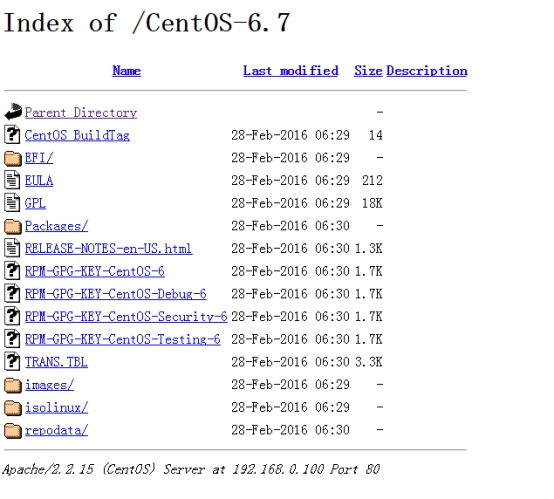

# Ubuntu软件安装与卸载

## 更新Ubuntu软件下载地址

 开源软件镜像站 ：https://mirrors.tuna.tsinghua.edu.cn/help/ubuntu/

Ubuntu 的软件源配置文件是 `/etc/apt/sources.list`。将系统自带的该文件做个备份，将该文件替换为下面内容，即可使用 TUNA 的软件源镜像。

ubuntu版本: 16.04 LTS

```
# 默认注释了源码镜像以提高 apt update 速度，如有需要可自行取消注释
deb https://mirrors.tuna.tsinghua.edu.cn/ubuntu/ xenial main restricted universe multiverse
# deb-src https://mirrors.tuna.tsinghua.edu.cn/ubuntu/ xenial main restricted universe multiverse
deb https://mirrors.tuna.tsinghua.edu.cn/ubuntu/ xenial-updates main restricted universe multiverse
# deb-src https://mirrors.tuna.tsinghua.edu.cn/ubuntu/ xenial-updates main restricted universe multiverse
deb https://mirrors.tuna.tsinghua.edu.cn/ubuntu/ xenial-backports main restricted universe multiverse
# deb-src https://mirrors.tuna.tsinghua.edu.cn/ubuntu/ xenial-backports main restricted universe multiverse
deb https://mirrors.tuna.tsinghua.edu.cn/ubuntu/ xenial-security main restricted universe multiverse
# deb-src https://mirrors.tuna.tsinghua.edu.cn/ubuntu/ xenial-security main restricted universe multiverse

# 预发布软件源，不建议启用
# deb https://mirrors.tuna.tsinghua.edu.cn/ubuntu/ xenial-proposed main restricted universe multiverse
# deb-src https://mirrors.tuna.tsinghua.edu.cn/ubuntu/ xenial-proposed main restricted universe multiverse
```

然后

```
sudo cp /etc/apt/sources.list /etc/apt/sources.list.backup
```

再sudo vim /etc/apt/sources.list修改为以上内容

## Ubuntu软件操作的相关命令

```
sudo apt-get update  更新源

sudo apt-get install package 安装包

sudo apt-get remove package 删除包

sudo apt-cache search package 搜索软件包

sudo apt-cache show package  获取包的相关信息，如说明、大小、版本等

sudo apt-get install package --reinstall   重新安装包

sudo apt-get -f install   修复安装

sudo apt-get remove package --purge 删除包，包括配置文件等

sudo apt-get build-dep package 安装相关的编译环境

sudo apt-get upgrade 更新已安装的包

sudo apt-get dist-upgrade 升级系统

sudo apt-cache depends package 了解使用该包依赖那些包

sudo apt-cache rdepends package 查看该包被哪些包依赖

sudo apt-get source package  下载该包的源代码

sudo apt-get clean && sudo apt-get autoclean 清理无用的包

sudo apt-get check 检查是否有损坏的依赖
```

# yum安装命令

yum（ Yellow dog Updater, Modified）是一个在Fedora和RedHat以及SUSE中的Shell前端软件包管理器。

基於RPM包管理，能够从指定的服务器自动下载RPM包并且安装，可以自动处理依赖性关系，并且一次安装所有依赖的软体包，无须繁琐地一次次下载、安装。

yum提供了查找、安装、删除某一个、一组甚至全部软件包的命令，而且命令简洁而又好记。

## 更新国内yum源

网易（163）yum源是国内最好的yum源之一 ，无论是速度还是软件版本，都非常的不错。

将yum源设置为163 yum，可以提升软件包安装和更新的速度，同时避免一些常见软件版本无法找到。

首先备份/etc/yum.repos.d/CentOS-Base.repo

```
mv /etc/yum.repos.d/CentOS-Base.repo /etc/yum.repos.d/CentOS-Base.repo.backup
```

下载对应版本 repo 文件, 放入 /etc/yum.repos.d/

- [CentOS5](http://mirrors.163.com/.help/CentOS5-Base-163.repo) ：http://mirrors.163.com/.help/CentOS5-Base-163.repo
- [CentOS6](http://mirrors.163.com/.help/CentOS6-Base-163.repo) ：http://mirrors.163.com/.help/CentOS6-Base-163.repo
- [CentOS7](http://mirrors.163.com/.help/CentOS7-Base-163.repo) ：http://mirrors.163.com/.help/CentOS7-Base-163.repo

```
wget http://mirrors.163.com/.help/CentOS7-Base-163.repo
mv CentOS7-Base-163.repo /etc/yum.repos.d/CentOS-Base.repo
```

运行以下命令生成缓存

```
yum clean all
yum makecache
```

除了网易之外，国内还有其他不错的 yum 源，比如中科大和搜狐。

中科大的 yum 源，安装方法查看：https://lug.ustc.edu.cn/wiki/mirrors/help/centos

sohu 的 yum 源安装方法查看: http://mirrors.sohu.com/help/centos.html

## yum常用命令

yum 语法：

```
yum [options] [command] [package ...]
```

选项：

- **options：**可选，选项包括-h（帮助），-y（当安装过程提示选择全部为"yes"），-q（不显示安装的过程）等等。
- **command：**要进行的操作。
- **package：**操作的对象。

实例：

- 列出所有可更新的软件清单命令：`yum check-update`
- 更新所有软件命令：`yum update`
- 仅安装指定的软件命令：`yum install <package_name>`
- 仅更新指定的软件命令：`yum update <package_name>`
- 显示包信息：`yum info <package_name>`
- 列出所有可安裝的软件清单命令：`yum list`
- 删除软件包命令：`yum remove <package_name>`
- 查找软件包 命令：`yum search <keyword>`
- 清除缓存命令:
  - yum clean packages: 清除缓存目录下的软件包
  - yum clean headers: 清除缓存目录下的 headers
  - yum clean oldheaders: 清除缓存目录下旧的 headers
  - yum clean, yum clean all (= yum clean packages; yum clean oldheaders) :清除缓存目录下的软件包及旧的headers


## yum在线安装MySQL5.7

Step1: 检测系统是否自带安装mysql

```
yum list installed | grep mysql
```

Step2: 删除系统自带的mysql及其依赖

```
yum -y remove mysql-libs.x86_64
```

Step3: 给CentOS添加rpm源，并且选择较新的源

```
wget dev.mysql.com/get/mysql-community-release-el7-5.noarch.rpm

yum localinstall mysql-community-release-el7-5.noarch.rpm

yum repolist all | grep mysql

yum-config-manager --disable mysql55-community

yum-config-manager --disable mysql56-community

yum-config-manager --enable mysql57-community-dmr

yum repolist enabled | grep mysql
```

Step4:安装mysql 服务器

```
yum install mysql-community-server
```

Step5: 启动mysql

```
service mysqld start
```

grep "password" /var/log/mysqld.log(查看临时密码)

```
SET PASSWORD = PASSWORD('your new password');
ALTER USER 'root'@'localhost' PASSWORD EXPIRE NEVER;
flush privileges;
```

默认的要求必须的设置格式：
包含数字、小写或大写字母以及特殊字符

默认的要求必须的设置格式：
包含数字、小写或大写字母以及特殊字符

如果不想复杂，可以使用以下方式

```
set global validate_password_policy=0;
set global validate_password_length=1;
```


Step6: 查看mysql是否自启动,并且设置开启自启动

```
# chkconfig --list | grep mysqld
# chkconfig mysqld on
```

Step7: mysql安全设置

```
mysql_secure_installation
```

## rpm

RPM是Red Hat公司随Redhat Linux推出了一个软件包管理器，通过它能够更加轻松容易地实现软件的安装。

常见用法：

rpm -ivh <rpm包名>	安装软件

rpm -e <rpm包名>	卸载安装

rpm -qi <rpm包名>   显示软件安装信息

rpm -qa | grep xxx	查询软件是否安装（包括相关依赖）

rpm -Uvh <rpm包名> 	升级一个rpm

具体参数详解：
    -i, --install		安装包
    -v, --verbose	列出更多详细信息，安装进度
    -h, --hash		安装时列出hash标记 (与 -v连用)
    -e, --erase		卸载安装包
    -U, --upgrade=<packagefile>+	升级包
        --replacepkge              无论软件包是否已被安装，都强行安装软件包
        --test                            安装测试，并不实际安装
        --nodeps                      忽略软件包的依赖关系强行安装
        --force                          忽略软件包及文件的冲突
    -q,--query:
          -a, --all		查询/校验所有的安装包
          -p, --package	查询/校验一个安装文件
          -l, --list		列出安装文件
          -d, --docfiles	列出所有文档文件
          -f, --file		查询/校验安装包中所包含的文件

安装软件

```
# rpm -hvi dejagnu-1.4.2-10.noarch.rpm 
警告：dejagnu-1.4.2-10.noarch.rpm: V3 DSA 签名：NOKEY, key ID db42a60e
准备...           
########################################### [100%]
```

显示软件安装信息

```
# rpm -qi dejagnu-1.4.2-10.noarch.rpm

【第1次更新 教程、类似命令关联】
```

# Linux的基本配置

1.修改主机名

```
vi /etc/sysconfig/network
NETWORKING=yes
HOSTNAME=hadoop1
```

2.修改ip地址

```
vi /etc/sysconfig/network-scripts/ifcfg-eth0
DEVICE=eth0
TYPE=Ethernet
ONBOOT=yes
BOOTPROTO=static
IPADDR=192.168.100.101
NETMASK=255.255.255.0

service network restart
```

3.修改ip地址和主机名的映射关系

```
vi /etc/hosts
127.0.0.1   localhost localhost.localdomain localhost4 localhost4.localdomain4
::1         localhost localhost.localdomain localhost6 localhost6.localdomain6
192.168.100.101 hadoop1
```

4.关闭iptables并设置其开机启动/不启动

```
service iptables stop
chkconfig iptables on
chkconfig iptables off
```

## 安装JDK

```
1.上传jdk-7u45-linux-x64.tar.gz到Linux上
2.解压jdk到/usr/local目录
tar -zxvf jdk-7u45-linux-x64.tar.gz -C /usr/local/
3.设置环境变量，在/etc/profile文件最后追加相关内容(技巧r:!pwd)
vi /etc/profile
export JAVA_HOME=/usr/local/jdk1.7.0_45
export PATH=$PATH:$JAVA_HOME/bin
4.刷新环境变量
source /etc/profile
5.测试java命令是否可用
java -version
```

## 制作本地YUM源

上传CentOS-6.7-x86_64-bin-DVD1.iso到服务器

将CentOS-6.7-x86_64-bin-DVD1.iso镜像挂载到某个目录:

```
mkdir /var/iso
mount -o loop CentOS-6.7-x86_64-bin-DVD1.iso /var/iso
```

安装并启动Apache服务器：

```
yum install -y httpd
service httpd start
```

使用浏览器访问http://192.168.100.101（如果访问不通，检查防火墙是否开启了80端口或关闭防火墙）

将YUM源配置到httpd中：

```
cp -r /var/iso/ /var/www/html/CentOS-6.7
umount /var/iso
```

在浏览器中访问http://192.168.100.101/CentOS-6.7/

 

配置使用YUM源：

备份原有的YUM源的配置文件

```
cd /etc/yum.repos.d/
rename .repo .repo.bak *
```

修改YUM源配置文件

```
vi CentOS-Local.repo
[base]
name=CentOS-Local
baseurl=http://192.168.100.101/CentOS-6.7
gpgcheck=1
enabled=1   #很重要，1才启用
gpgkey=file:///etc/pki/rpm-gpg/RPM-GPG-KEY-CentOS-6
```

重建yum缓存

```
#清除yum缓存文件，重新新建
yum clean all && yum makecache
#列出可用的YUM源
yum repolist
```

rpm包生成yum源目录

如果已经下载好了rpm包，可以自行制作一个yum源（yum仓库）。将下载的rpm包上传到centos服务器上（比如/data/rpm目录下），然后进入存放rpm包的目录，执行以下命令：

```
# cd /data/rpm
# createrepo .
```

这样，rpm包存放的目录就可以作为yum源目录使用。
如果提示找不到createrepo命令，可以使用yum install createrepo安装该程序。

