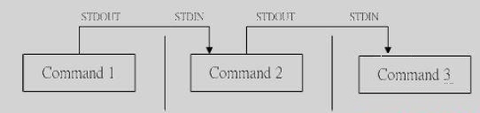

# [Linux]管道命令

Linux的管道命令是'|'，通过它可以对数据进行连续处理，其示意图如下：

  

注意：

1）管道命令仅处理标准输出，对于标准错误输出，将忽略

2）管道命令右边命令，必须能够接收标准输入流命令才行，否则传递过程中数据会抛弃。 

常用来作为接收数据管道命令有： less,more,head,tail，而ls, cp, mv就不行。 

### wc - 统计字数

可以计算文件的Byte数、字数、或是列数，若不指定文件名称、或是所给予的文件名为"-"，则wc指令会从标准输入设备读取数据。

```
wc [-lwm] [filename]
-l: 统计行数
-w：统计英文单词
-m：统计字符数
python@xxx:~$ wc -l /etc/passwd
49 /etc/passwd
python@xxx:~$ wc -w /etc/passwd
81 /etc/passwd
python@xxx:~$ wc -m /etc/passwd
2696 /etc/passwd
```

在默认的情况下，wc将计算指定文件的行数、字数，以及字节数。使用的命令为：

```
$ wc testfile           # testfile文件的统计信息  
3 92 598 testfile       # testfile文件的行数为3、单词数92、字节数598 
```

其中，3 个数字分别表示testfile文件的行数、单词数，以及该文件的字节数。

如果想同时统计多个文件的信息，例如同时统计testfile、testfile_1、testfile_2，可使用如下命令：

```
$ wc testfile testfile_1 testfile_2  #统计三个文件的信息  
3 92 598 testfile                    #第一个文件行数为3、单词数92、字节数598  
9 18 78 testfile_1                   #第二个文件的行数为9、单词数18、字节数78  
3 6 32 testfile_2                    #第三个文件的行数为3、单词数6、字节数32  
15 116 708 总用量                    #三个文件总共的行数为15、单词数116、字节数708 
```

### cut - 列选取命令

```
选项与参数：
-d  ：后面接分隔字符。与 -f 一起使用；
-f  ：依据 -d 的分隔字符将一段信息分割成为数段，用 -f 取出第几段的意思；
-c  ：以字符 (characters) 的单位取出固定字符区间；
```

cut以行为单位，根据分隔符把行分成若干列，这样就可以指定选取哪些列了。

```
cut -d '分隔字符' -f 选取的列数
echo $PATH|cut -d ':' -f 2  	--选取第2列
echo $PATH|cut -d ':' -f 3,5  	--选取第3列和第5列
echo $PATH|cut -d ':' -f 3-5  	--选取第3列到第5列
echo $PATH|cut -d ':' -f 3-   	--选取第3列到最后1列
echo $PATH|cut -d ':' -f 1-3,5	--选取第1到第3列还有第5列
```

只显示/etc/passwd的用户和shell：

```
#cat /etc/passwd | cut -d ':' -f 1,7 
root:/bin/bash
daemon:/bin/sh
bin:/bin/sh
```

### grep - 行选取命令

grep一般格式为：

```
grep [-cinv] '查找的字符串' filename
```

在grep命令中输入字符串参数时，最好引号或双引号括起来。例如：`grep 'a' 1.txt`。

常用选项说明：

| 选项 | 含义                                     |
| :--- | ---------------------------------------- |
| -v   | 显示不包含匹配文本的所有行（相当于求反） |
| -n   | 显示匹配行及行号                         |
| -i   | 忽略大小写                               |
| -c   | 计算找到的行数                           |

grep搜索内容串可以是正则表达式，常用正则表达式：

| 参数         | 含义                                                         |
| :----------- | ------------------------------------------------------------ |
| ^a           | 行首,搜寻以 m 开头的行；grep -n '^a' 1.txt                   |
| ke$          | 行尾,搜寻以 ke 结束的行；grep -n 'ke$' 1.txt                 |
| [Ss]igna[Ll] | 匹配 [] 里中一系列字符中的一个；搜寻匹配单词signal、signaL、Signal、SignaL的行；grep -n '[Ss]igna[Ll]' 1.txt |
| .            | .匹配一个非换行符的字符；grep -n 'e.e' 1.txt可以匹配 eee，eae，eve，但是不匹配 ee，eaae； |
| *            | 匹配零个或多个先前字符                                       |
| [^]          | 匹配一个不在指定范围内的字符                                 |
| `\(..\)`     | 标记匹配字符                                                 |
| \            | 锚定单词的开始                                               |
| `\<`         | 锚定单词的开头                                               |
| `\>`         | 锚定单词的结束                                               |
| `x\{m\}`     | 重复字符x，m次                                               |
| `x\{m,\}`    | 重复字符x,至少m次                                            |
| `x\{m,n\}`   | 重复字符x，至少m次，不多于n次                                |
| \w           | 匹配文字和数字字符，也就是[A-Za-z0-9]                        |
| \b           | 单词锁定符                                                   |

实例：
显示所有以“h”结尾的行
grep h$
匹配所有以“a”开头且以“e”结尾的，中间包含2个字符的单词
grep '\<a..e\>'
显示所有包含一个”y”或”h”字符的行
grep [yh]
显示不包含字母a~k 且后紧跟“pple”的单词

`grep [^a-k]pple`

从系统词典中选择所有以“c”开头且以“o”结尾的单词
`grep '\<c.*o\>'`
找出一个文件中或者输出中找到包含`*`的行
`grep '\*'`
显示所有包含每个字符串至少有20个连续字母的单词的行
`grep [a-Z]\{20,\}`

### sort - 排序

**语法：**

```
sort [-fbMnrtuk] [file or stdin]
```

**参数说明**：

- -f  ：忽略大小写的差异，例如 A 与 a 视为编码相同；
- -b  ：忽略最前面的空格符部分；
- -M  ：以月份的名字来排序，例如 JAN, DEC 等等的排序方法；
- -n  ：使用『纯数字』进行排序(默认是以文字型态来排序的)；
- -r  ：反向排序；
- -u  ：就是 uniq ，相同的数据中，仅出现一行代表；
- -t  ：分隔符，默认是用 [tab] 键来分隔；
- -k  ：以哪个区间 (field) 来进行排序

默认是以第一个字符升序排序:

```
# cat /etc/passwd | sort 
adm:x:3:4:adm:/var/adm:/sbin/nologin
avahi-autoipd:x:100:156:avahi-autoipd:/var/lib/avahi-autoipd:/sbin/nologin
avahi:x:70:70:Avahi daemon:/:/sbin/nologin
bin:x:1:1:bin:/bin:/sbin/nologin
......
```

以第3列排序：

```
[root@www ~]# cat /etc/passwd | sort -t ':' -k 3
root:x:0:0:root:/root:/bin/bash
uucp:x:10:14:uucp:/var/spool/uucp:/sbin/nologin
operator:x:11:0:operator:/root:/sbin/nologin
bin:x:1:1:bin:/bin:/sbin/nologin
games:x:12:100:games:/usr/games:/sbin/nologin
```

使用数字排序：

```
cat /etc/passwd | sort -t ':' -k 3n
root:x:0:0:root:/root:/bin/bash
daemon:x:1:1:daemon:/usr/sbin:/bin/sh
bin:x:2:2:bin:/bin:/bin/sh
```

倒序排序：

```
cat /etc/passwd | sort -t ':' -k 3nr
nobody:x:65534:65534:nobody:/nonexistent:/bin/sh
ntp:x:106:113::/home/ntp:/bin/false
messagebus:x:105:109::/var/run/dbus:/bin/false
sshd:x:104:65534::/var/run/sshd:/usr/sbin/nologin
或者
cat /etc/passwd | sort -t ':' -k 3 -nr
```

 先以第六个域的第2个字符到第4个字符进行正向排序，再基于第一个域进行反向排序：

```
cat /etc/passwd |  sort -t ':' -k 6.2,6.4 -k 1r      
sync:x:4:65534:sync:/bin:/bin/sync
proxy:x:13:13:proxy:/bin:/bin/sh
bin:x:2:2:bin:/bin:/bin/sh
sys:x:3:3:sys:/dev:/bin/sh
```

查看/etc/passwd有多少个shell:

方法对/etc/passwd的第七个域排序并去重，然后统计行数：

```
[root@VM_0_9_centos ~]# cat /etc/passwd |  sort -t':' -k 7 -u
root:x:0:0:root:/root:/bin/bash
syslog:x:996:994::/home/syslog:/bin/false
sync:x:5:0:sync:/sbin:/bin/sync
halt:x:7:0:halt:/sbin:/sbin/halt
bin:x:1:1:bin:/bin:/sbin/nologin
shutdown:x:6:0:shutdown:/sbin:/sbin/shutdown
[root@VM_0_9_centos ~]# cat /etc/passwd |  sort -t':' -k 7 -u|wc -l
6
```

### uniq - 去重

```
选项与参数：
-i   ：忽略大小写字符的不同；
-c  ：进行计数
-u  ：只显示唯一的行
```

该命令用于排完序之后，对排序结果进行去重

```
python@xxx:~$ last | cut -d ' ' -f 1  | sort | uniq

haha
python
reboot
wtmp
python@xxx:~$ last | cut -d ' ' -f 1  | sort | uniq -c
      1 
      2 haha
     22 python
      7 reboot
      1 wtmp
```

排序文件，默认是去重：

```
#cat words | sort |uniq
friend
hello
world
```

排序之后删除了重复行，同时在行首位置输出该行重复的次数：

```
#sort testfile | uniq -c
1 friend
3 hello
2 world
```

仅显示存在重复的行，并在行首显示该行重复的次数：

```
#sort testfile | uniq -dc
3 hello
2 world
```

仅显示不重复的行：

```
sort testfile | uniq -u
friend
```

### tee - 同时输出多个文件

从标准输入设备读取数据，将其内容输出到标准输出设备，同时保存成文件。 

一般情况下用重定向实现，需要同时输出多个文件时可以使用该命令。

**参数**：

- -a或--append 　附加到既有文件的后面，而非覆盖它．

将输出同时保存到多个文件中，同时将输出内容显示到控制台：

```
python@xxx:~/test$ echo "hello world"|tee f1 f2 
hello world
python@xxx:~/test$ cat f1
hello world
python@xxx:~/test$ echo "hello world"|tee f1 f2 -a
hello world
python@xxx:~/test$ cat f1
hello world
hello world
```

### tr - 替换指定的字符

不指定参数时，即表示替换指定的字符为另一个字符，支持指定的字符集合。

**参数说明：**

- -d, --delete：删除指定的字符
- -s, --squeeze-repeats：缩减连续重复的字符成指定的单个字符

字符集合的范围：

- \NNN 八进制值的字符 NNN (1 to 3 为八进制值的字符)
- \\ 反斜杠
- \a Ctrl-G 铃声
- \b Ctrl-H 退格符
- \f Ctrl-L 走行换页
- \n Ctrl-J 新行
- \r Ctrl-M 回车
- \t Ctrl-I tab键
- \v Ctrl-X 水平制表符
- CHAR1-CHAR2 ：字符范围从 CHAR1 到 CHAR2 的指定，范围的指定以 ASCII 码的次序为基础，只能由小到大，不能由大到小。
- [CHAR*] ：这是 SET2 专用的设定，功能是重复指定的字符到与 SET1 相同长度为止
- [CHAR*REPEAT] ：这也是 SET2 专用的设定，功能是重复指定的字符到设定的 REPEAT 次数为止(REPEAT 的数字采 8 进位制计算，以 0 为开始)
- [:alnum:] ：所有字母字符与数字
- [:alpha:] ：所有字母字符
- [:blank:] ：所有水平空格
- [:cntrl:] ：所有控制字符
- [:digit:] ：所有数字
- [:graph:] ：所有可打印的字符(不包含空格符)
- [:lower:] ：所有小写字母
- [:print:] ：所有可打印的字符(包含空格符)
- [:punct:] ：所有标点字符
- [:space:] ：所有水平与垂直空格符
- [:upper:] ：所有大写字母
- [:xdigit:] ：所有 16 进位制的数字
- [=CHAR=] ：所有符合指定的字符(等号里的 CHAR，代表你可自订的字符)

将文件testfile中的小写字母全部转换成大写字母：

```
cat testfile |tr a-z A-Z 
或
cat testfile |tr [:lower:] [:upper:] 
```

缩减连续重复的字符成指定的单个字符：

```
python@xxx:~/test$ cat t
dddddddsssssdd
eeeeeeeeee
aaaaaaaaaaaaaa
vvvvvvvvvvvvvv
python@xxx:~/test$ cat t|tr -s 'se'
dddddddsdd
e
aaaaaaaaaaaaaa
vvvvvvvvvvvvvv
python@xxx:~/test$ cat t|tr -s 'sdeav'
dsd
e
a
v
```

删除指定的字符：

```
python@xxx:~/test$ cat t|tr -d 'dv'
sssss
eeeeeeeeee
aaaaaaaaaaaaaa
```

### join - 文件按行连接

将两个文件中指定栏位相同的行连接起来。即按照两个文件中共同拥有的某一列，将对应的行拼接成一行。

注意：在使用join之前所处理的文件要事先经过排序。

```
$ cat testfile_1
Hello 95 #例如，本例中第一列为姓名，第二列为数额  
Linux 85  
test 30  
cmd@hdd-desktop:~$ cat testfile_2
Hello 2005 #例如，本例中第一列为姓名，第二列为年份  
Linux 2009  
test 2006 
```

使用join命令，将两个文件连接：

```
$ join testfile_1 testfile_2 #连接testfile_1、testfile_2中的内容  
Hello 95 2005 #连接后显示的内容  
Linux 85 2009  
test 30 2006 
```

两个文件互换，输出结果的变化：

```
$ join testfile_2 testfile_1 #改变文件顺序连接两个文件  
Hello 2005 95 #连接后显示的内容  
Linux 2009 85  
test 2006 30 
```

**参数**：

- -a<1或2> 除了显示原来的输出内容之外，还显示指令文件中没有相同栏位的行。
- -e<字符串> 若[文件1]与[文件2]中找不到指定的栏位，则在输出中填入选项中的字符串。
- -i或--igore-case 比较栏位内容时，忽略大小写的差异。
- -o<格式> 按照指定的格式来显示结果。
- -t<字符> 使用栏位的分隔字符。
- -v<1或2> 跟-a相同，但是只显示文件中没有相同栏位的行。
- -1<栏位> 连接[文件1]指定的栏位。
- -2<栏位> 连接[文件2]指定的栏位。

### paste-将多个文件对应行链接在一起 

paste 指令会把每个文件以列对列的方式，一列列地加以合并。

语法：

```
paste [-s][-d <间隔字符>][文件...]
```

**参数**：

- -d<间隔字符>或--delimiters=<间隔字符> 　用指定的间隔字符取代跳格字符。
- -s或--serial 　串列进行而非平行处理。
- [文件…] 指定操作的文件路径

使用paste指令将文件"file"、"testfile"、"testfile1"进行合并，输入如下命令：

```
$ cat file                  #file文件的内容  
xiongdan 200  
lihaihui 233  
lymlrl 231  
$ cat testfile              #testfile文件的内容  
liangyuanm  ss  
$ cat testfile1             #testfile1文件的内容  
huanggai 56  
zhixi 73 
$ paste file testfile testfile1
xiongdan 200    liangyuanm ss   huanggai 56
lihaihui 233            zhixi 73
lymlrl 231
$ paste -d ':' file testfile testfile1
xiongdan 200:liangyuanm ss:huanggai 56
lihaihui 233::zhixi 73
lymlrl 231::
```

参数"-s"可以将一个文件中的多行数据合并为一行进行显示：

```
$ paste -s file             #合并指定文件的多行数据
xiongdan 200 lihaihui 233 lymlrl 231 
```

 如果将文件位置改为-，表示接收标准输入：

```
$ cat file |paste testfile1 -
huanggai 56     xiongdan 200
zhixi 73        lihaihui 233
        lymlrl 231
```

### split - 文件切割

split命令用于将一个文件分割成数个。

该指令将大文件分割成较小的文件，在默认情况下将按照每1000行切割成一个小文件。

语法：

```
split [-bl] file prefix
-b: 以大小切割
-l：以行数切割
prefix：切割后文件的前缀
```

**参数说明**：

- -<行数> : 指定每多少行切成一个小文件
- -b<字节> : 指定每多少字节切成一个小文件
- -C<字节> : 与参数"-b"相似，但是在切 割时将尽量维持每行的完整性
- [输出文件名] : 设置切割后文件的前置文件名， split会自动在前置文件名后再加上编号

使用指令"split"将文件"README"每6行切割成一个文件，输入如下命令：

```
$ split -6 README       #将README文件每六行分割成一个文件 
$ ls                                #执行ls指令  
#获得当前目录结构
README xaa xad xag xab xae xah xac xaf xai
```

以上命令执行后，指令"split"会将原来的大文件"README"切割成多个以"x"开头的小文件。而在这些小文件中，每个文件都只有6行内容。

以大小切割：

```
$ ls -lh disease.dmp
-rwxr-xr-x 1 root root 122M Jul  4  2013 disease.dmp
$ split -b 50m disease.dmp disease.dmp
$ ls -lh disease.dmp*
-rwxr-xr-x 1 root root 122M Jul  4  2013 disease.dmp
-rw-r--r-- 1 root root  50M Jan  9 16:10 disease.dmpaa
-rw-r--r-- 1 root root  50M Jan  9 16:10 disease.dmpab
-rw-r--r-- 1 root root  22M Jan  9 16:10 disease.dmpac
```

### xargs - 参数代换

不是所有的命令都支持管道，如ls，对于不支持管道的命令，可以通过xargs让其有管道命令的效果，如下所示：

```
# find /sbin -perm +7000 | xargs ls -l
-rwsr-x--- 1 root ecryptfs 19896 Feb 23  2012 /sbin/mount.ecryptfs_private
-rwsr-xr-x 1 root root     75496 Jan  9  2013 /sbin/mount.nfs
-rwsr-xr-x 1 root root     75504 Jan  9  2013 /sbin/mount.nfs4
-rwxr-sr-x 1 root root      8544 Feb 22  2012 /sbin/netreport
-rwsr-xr-x 1 root root     14112 Nov  2  2010 /sbin/pam_timestamp_check
-rwsr-xr-x 1 root root     75504 Jan  9  2013 /sbin/umount.nfs
-rwsr-xr-x 1 root root     75504 Jan  9  2013 /sbin/umount.nfs4
-rwsr-xr-x 1 root root     19768 Nov  2  2010 /sbin/unix_chkpwd
```

如果没有xargs，ls -l的结果将不是前面find的标准输出，因为ls不支持管道命令。

xargs 用作替换工具，读取输入数据重新格式化后输出。

定义一个测试文件，内有多行文本数据：

```
# cat test.txt
a b c d e f g
h i j k l m n
o p q
r s t
u v w x y z
```

多行输入单行输出：

```
# cat test.txt | xargs
a b c d e f g h i j k l m n o p q r s t u v w x y z
```

-n 选项多行输出：

```
# cat test.txt | xargs -n3
a b c
d e f
g h i
j k l
m n o
p q r
s t u
v w x
y z
```

-d 选项可以自定义一个定界符：

```
# echo "nameXnameXnameXname" | xargs -dX
name name name name
```

结合 -n 选项使用：

```
# echo "nameXnameXnameXname" | xargs -dX -n2
name name
name name
```

读取 stdin，将格式化后的参数传递给命令:

```
# cat sk.sh
#!/bin/bash
#sk.sh命令内容，打印出所有参数。
echo $*
# cat arg.txt
aaa
bbb
ccc
# cat arg.txt | xargs -I {} ./sk.sh -p {} -l
-p aaa -l
-p bbb -l
-p ccc -l
```

选项`-I`指定一个替换字符串 {}，这个字符串在 xargs 扩展时会被替换掉。

复制所有图片文件到 /data/images 目录下：

```
ls *.jpg | xargs -n1 -I {} cp {} /data/images
```

选项`-n` 后面加次数，表示命令在执行的时候一次用的argument的个数，默认是用所有的。

**xargs 结合 find 使用**

用 rm 删除太多的文件时候，可能得到一个错误信息：**/bin/rm Argument list too long.** 用 xargs 去避免这个问题：

```
find . -type f -name "*.log" -print0 | xargs -0 rm -f
```

xargs -0 将 \0 作为定界符。

统计一个源代码目录中所有 php 文件的行数：

```
find . -type f -name "*.php" -print0 | xargs -0 wc -l
```

查找所有的 jpg 文件，并且压缩它们：

```
find . -type f -name "*.jpg" -print | xargs tar -czvf images.tar.gz
```

批量下载：

```
# cat url-list.txt | xargs wget -c
```

wget的`-c`选项表示断点续传。


