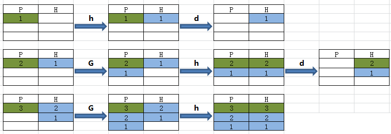

# cut命令

```
选项与参数：
-d  ：后面接分隔字符。与 -f 一起使用；
-f  ：依据 -d 的分隔字符将一段信息分割成为数段，用 -f 取出第几段的意思；
-c  ：以字符 (characters) 的单位取出固定字符区间；
```

cut以行为单位，根据分隔符把行分成若干列，这样就可以指定选取哪些列了。

```
cut -d '分隔字符' -f 选取的列数
echo $PATH|cut -d ':' -f 2  	--选取第2列
echo $PATH|cut -d ':' -f 3,5  	--选取第3列和第5列
echo $PATH|cut -d ':' -f 3-5  	--选取第3列到第5列
echo $PATH|cut -d ':' -f 3-   	--选取第3列到最后1列
echo $PATH|cut -d ':' -f 1-3,5	--选取第1到第3列还有第5列
```

只显示/etc/passwd的用户和shell：

```
#cat /etc/passwd | cut -d ':' -f 1,7 
root:/bin/bash
daemon:/bin/sh
bin:/bin/sh
```

# sed命令

sed 可依照脚本的指令来处理、编辑文本文件。

Sed 主要用来自动编辑一个或多个文件、简化对文件的反复操作、编写转换程序等。

语法:

```
sed [-e<script>][-f<script文件>][文本文件]
```

**参数说明**：

- `-e <script>`以指定的script来处理输入的文本文件。
- `-f<script文件>`以指定的script文件来处理输入的文本文件。
- `-n`仅显示script处理后的结果，一般跟p动作搭配使用。
- `-i`使用处理后的结果修改文件。

**动作说明**：

- a：在指定行后面插入内容
- i：在指定行前面插入内容
- d：删除指定行
- c ：替换指定行
- p ：打印指定行的数据，通常需要跟`-n`选项搭配使用
- s ：替换指定字符，兼容vim的替换语法，例如 1,20s/old/new/g

## 元字符集

sed支持一般的正则表达式，下面是支持的正则语法：
`^`行的开始 如：/^sed/匹配所有以sed开头的行。 
`$`行的结束 如：/sed$/匹配所有以sed结尾的行。 
`.`匹配一个非换行符的任意字符 如：/s.d/匹配s后接一个任意字符，然后是d。 
`*`匹配零或多个字符 如：/*sed/匹配所有模板是一个或多个空格后紧跟sed的行。 
`[]`匹配一个指定范围内的字符，如`/[Ss]ed/`匹配sed和Sed。 
`[^]`匹配一个不在指定范围内的字符，如：`/[^A-RT-Z]ed/`匹配不包含A-R和T-Z的一个字母开头，紧跟ed的行。 
`\(..\)`保存匹配的字符，如s/\(love\)able/\1rs，loveable被替换成lovers。 
`&`保存搜索字符用来替换其他字符，如`s/love/**&**/`，love这成`**love**`。 
`\<`单词的开始，如:/\<love/匹配包含以love开头的单词的行。 
`\>`单词的结束，如/love\>/匹配包含以love结尾的单词的行。 
`x\+`重复字符x，至少1次，如：`/o\+/`匹配至少有1个o的行。 
`x\{m\}`重复字符x，m次，如：`/o\{5\}/`匹配包含5个o的行。 
`x\{m,\}`重复字符x,至少m次，如：`/o\{5,\}/`匹配至少有5个o的行。 
`x\{m,n\}`重复字符x，至少m次，不多于n次，如：`/o\{5,10\}/`匹配5-10个o的行。

## a|i:在指定行位置添加行

```
python@xxx:~/test$ cat testfile              
 LINUX!  
 Linux is a free unix-type opterating system.  
 This is a linux testfile!  
 Linux test 

python@xxx:~/test$ sed -e 2a\newline testfile 
 LINUX!  
 Linux is a free unix-type opterating system.  
newline
 This is a linux testfile!  
 Linux test 
 
```

默认情况下`-e`参数可以省略：

```
python@xxx:~/test$ cat testfile|sed '2a\newline'
 LINUX!  
 Linux is a free unix-type opterating system.  
newline
 This is a linux testfile!  
 Linux test 

python@xxx:~/test$ sed '2a newline' testfile
 LINUX!  
 Linux is a free unix-type opterating system.  
newline
 This is a linux testfile!  
 Linux test 
```

`<script>`中的内容最好用单引号括起来，如果脚本内容不存在空白字符也可以省略单引号。

在第二行之前添加一行：

```
python@xxx:~/test$ sed '2i newline' testfile 
 LINUX!  
newline
 Linux is a free unix-type opterating system.  
 This is a linux testfile!  
 Linux test 
```

最后一行加入 `# This is a test`:

```
python@xxx:~/test$ sed '$a # This is a test' testfile 
 LINUX!  
 Linux is a free unix-type opterating system.  
 This is a linux testfile!  
 Linux test 
# This is a test
```

同时添加多行：

```
python@xxx:~/test$ cat testfile|sed '2a\newline1\
> newline2'
 LINUX!  
 Linux is a free unix-type opterating system.  
newline1
newline2
 This is a linux testfile!  
 Linux test 
```

## d:删除指定行

将 /etc/passwd 的内容列出行号，并将第 2~5 行删除！

```
[root@www ~]# nl /etc/passwd | sed '2,5d'
1 root:x:0:0:root:/root:/bin/bash
6 sync:x:5:0:sync:/sbin:/bin/sync
7 shutdown:x:6:0:shutdown:/sbin:/sbin/shutdown
.....(后面省略).....
```

只删除第2行：

```
nl /etc/passwd | sed '2d' 
```

删除第3到最后一行：

```
nl /etc/passwd | sed '3,$d' 
```

删除/etc/passwd所有包含`/usr/sbin/nologin`的行，其他行输出：

```
python@xxx:~/test$ nl /etc/passwd | sed  '/\/usr\/sbin\/nologin/d'
1  root:x:0:0:root:/root:/bin/bash
5  sync:x:4:65534:sync:/bin:/bin/sync
19  systemd-timesync:x:100:102:systemd Time Synchronization,,,:/run/systemd:/bin/false
20  systemd-network:x:101:103:systemd Network Management,,,:/run/systemd/netif:/bin/false
....下面忽略
```

## c:替换指定行

将第2-5行的内容替换成为『No 2-5 number』：

```
python@xxx:~/test$ nl /etc/passwd | sed '2,5c No 2-5 number'
1  root:x:0:0:root:/root:/bin/bash
No 2-5 number
6  games:x:5:60:games:/usr/games:/usr/sbin/nologin
.....(后面省略).....
```

## p:仅显示指定行

不加`-n`选项时，除了输出匹配行，还同时会输出所有行，所以需要加`-n`选项。

仅列出 /etc/passwd 文件内的第 5-7 行：

```
python@xxx:~/test$ nl /etc/passwd | sed -n '5,7p'
5  sync:x:4:65534:sync:/bin:/bin/sync
6  games:x:5:60:games:/usr/games:/usr/sbin/nologin
7  man:x:6:12:man:/var/cache/man:/usr/sbin/nologin
```

搜索 /etc/passwd有root关键字的行：

```
python@xxx:~/test$ cat /etc/passwd | sed -n '/root/p'  
root:x:0:0:root:/root:/bin/bash
python@xxx:~/test$ sed -n '/root/p' /etc/passwd      
root:x:0:0:root:/root:/bin/bash
```

打印/etc/passwd有以root和bin开头之间的行：

```
python@xxx:~/test$ cat /etc/passwd | sed -n '/^root/,/^bin/p'
root:x:0:0:root:/root:/bin/bash
daemon:x:1:1:daemon:/usr/sbin:/usr/sbin/nologin
bin:x:2:2:bin:/bin:/usr/sbin/nologin
```

打印从第五行开始到第一个包含以`/var/mail`开始的行之间的所有行：

```
python@xxx:~/test$ nl /etc/passwd | sed -n '5,\/var\/mail/p'   
     5  sync:x:4:65534:sync:/bin:/bin/sync
     6  games:x:5:60:games:/usr/games:/usr/sbin/nologin
     7  man:x:6:12:man:/var/cache/man:/usr/sbin/nologin
     8  lp:x:7:7:lp:/var/spool/lpd:/usr/sbin/nologin
     9  mail:x:8:8:mail:/var/mail:/usr/sbin/nologin
```

## s:字符串替换

语法：

```
sed 's/要被取代的字串/新的字串/g'
```

不论什么字符，紧跟着s命令的都被认为是新的分隔符.

`sed 's#10#100#g'`表示把所有10替换成100，“#”在这里是分隔符，代替了默认的“/”分隔符。

提取本机所有的ip地址：

```
[root@VM_0_9_centos ~]# ifconfig | grep 'inet '
        inet 172.16.0.9  netmask 255.255.240.0  broadcast 172.16.15.255
        inet 127.0.0.1  netmask 255.0.0.0
[root@VM_0_9_centos ~]# ifconfig | grep 'inet '|sed 's/^[^0-9]*\([0-9\.]*\).*$/\1/g'
172.16.0.9
127.0.0.1
```

对于以root和bin开头之间的行，每行的末尾添加sed test：

```
python@xxx:~/test$ cat /etc/passwd | sed '/^root/,/^bin/s/$/--sed test/'  
root:x:0:0:root:/root:/bin/bash--sed test
daemon:x:1:1:daemon:/usr/sbin:/usr/sbin/nologin--sed test
bin:x:2:2:bin:/bin:/usr/sbin/nologin--sed test
sys:x:3:3:sys:/dev:/usr/sbin/nologin
```

## y:单字符替换

跟s一样也用于替换，不过s替换的是整体，y替换的是每一字母对应的单个字母

把data中的第一行至第三行中的a替换成A，b替换成B，c替换成C：

```
sed '1,3y/abc/ABC/' data 
```

示例：

```
python@ubuntu:~/test$ echo "123" | sed 'y/13/34/' 
324
python@ubuntu:~/test$ echo "axxbxxcxx" | sed 'y/abc/123/'
1xx2xx3xx
```

## `hHgG`模式空间&保持空间

h命令是将当前模式空间中内容覆盖至保持空间，H命令是将当前模式空间中的内容追加至保持空间

g命令是将当前保持空间中内容覆盖至模式空间，G命令是将当前保持空间中的内容追加至模式空间

模拟tac命令：

```
python@ubuntu:~/test$ cat log.txt 
2 this is a test
3 Are you like awk
This's a test
10 There are orange,apple,mongo
python@ubuntu:~/test$ cat log.txt |sed '1!G;h;$!d'
10 There are orange,apple,mongo
This's a test
3 Are you like awk
2 this is a test
```

1!G第1行不 执行“G”命令，从第2行开始执行。

$!d，最后一行不删除（保留最后1行）

下图P表示模式空间，H代表保持空间：



递增序列： 

```
python@ubuntu:~/test$ seq 3
1
2
3
python@ubuntu:~/test$ seq 3|sed 'H;g'
1

1
2

1
2
3
```

## 多次指定`-e`选项进行多点编辑

删除/etc/passwd第三行到末尾的数据，并把bash替换为blueshell：

```
nl /etc/passwd | sed -e '3,$d' -e 's/bash/blueshell/'
1  root:x:0:0:root:/root:/bin/blueshell
2  daemon:x:1:1:daemon:/usr/sbin:/bin/sh
```

删除一个文件以#开头的行和空行：

```
python@xxx:~/test$ nl abc -ba
     1
     2  b
     3  a
     4
     5  # aaaa
     6
     7  ddd
     8
     9  # sss
    10  eeee
    11
python@xxx:~/test$ sed -e '/^#/d' -e '/^$/d' abc
b
a
ddd
eeee
```

也可以通过`;`实现

```
python@ubuntu:~/test$ nl /etc/passwd | sed '3,$d;s/bash/blueshell/'
     1  root:x:0:0:root:/root:/bin/blueshell
     2  daemon:x:1:1:daemon:/usr/sbin:/usr/sbin/nologin
python@ubuntu:~/test$ sed '/^#/d;/^$/d' abc
b
a
ddd
eeee
```

## 选项`-i`直接修改文件内容

默认情况下sed命令仅仅只是将处理结果显示在控制台，加`-i`选项则会修改文件内容。

将 regular_express.txt 内每一行结尾若为 . 则换成 !

```
[root@www ~]# cat regular_express.txt 
taobao.
google.
taobao.
facebook.
zhihu-
weibo-
[root@www ~]# sed -i 's/\.$/\!/g' regular_express.txt
[root@www ~]# cat regular_express.txt 
taobao!
google!
taobao!
facebook!
zhihu-
weibo-
```

# awk命令

AWK是一种处理文本文件的语言，是一个强大的文本分析工具。

之所以叫AWK是因为其取了三位创始人 Alfred Aho，Peter Weinberger, 和 Brian Kernighan 的 Family Name 的首字符。

语法：

```
awk [选项参数] 'script' var=value file(s)
或
awk [选项参数] -f scriptfile var=value file(s)
```

**选项参数说明：**

- -F fs or --field-separator fs
  指定输入文件折分隔符，fs是一个字符串或者是一个正则表达式，如-F:。
- -v var=value or --asign var=value
  赋值一个用户定义变量。
- -f scripfile or --file scriptfile
  从脚本文件中读取awk命令。

## 基本用法

```
awk '{[pattern] action}' file
```

每行按空格或TAB分割，输出文本中的1、4列：

```
python@ubuntu:~/test$ cat log.txt 
2 this is a test
3 Are you like awk
This's a test
10 There are orange,apple,mongo
python@ubuntu:~/test$ awk '{print $1,$4}' log.txt
2 a
3 like
This's 
10 orange,apple,mongo
```

格式化输出：

```
python@ubuntu:~/test$ awk '{printf "%-8s %-10s\n",$1,$4}' log.txt
2        a         
3        like      
This's             
```

### `-F`指定分割字符

```
awk -F  #-F相当于内置变量FS, 指定分割字符
```

使用:分割,取/etc/passwd文件每个用户对应shell：

```
python@ubuntu:~/test$ awk -F: '{print $1,$7}'  /etc/passwd 
root /bin/bash
daemon /usr/sbin/nologin
bin /usr/sbin/nologin
sys /usr/sbin/nologin
sync /bin/sync
# 或者使用内建变量
python@ubuntu:~/test$ awk 'BEGIN{FS=":"} {print $1,$7}'  /etc/passwd  
root /bin/bash
daemon /usr/sbin/nologin
bin /usr/sbin/nologin
```

同时使用:和/l两个分隔符分割/etc/passwd文件

```
python@ubuntu:~/test$ awk -F '[:\/]' '{print $1,$7}'  /etc/passwd      
root root
daemon usr
bin bin
```

### `-v`设置变量

```
awk -v  # 设置变量
```

例子：

```
python@ubuntu:~/test$ cat log.txt 
2 this is a test
3 Are you like awk
This's a test
10 There are orange,apple,mongo
python@ubuntu:~/test$ awk -va=1 '{print $1,$1+a}' log.txt
2 3
3 4
This's 1
10 11
python@ubuntu:~/test$ awk -va=1 -vb=s '{print $1,$1+a,$1b}' log.txt
2 3 2s
3 4 3s
This's 1 This'ss
10 11 10s
```

### `-f`指定awk脚本

```
awk -f {awk脚本} {文件名}
```

脚本模块：

- BEGIN{ 这里面放的是执行前的语句 }
- END {这里面放的是处理完所有的行后要执行的语句 }
- {这里面放的是处理每一行时要执行的语句}

假设有这么一个文件（学生成绩表）：

```
$ cat score.txt
Marry   2143 78 84 77
Jack    2321 66 78 45
Tom     2122 48 77 71
Mike    2537 87 97 95
Bob     2415 40 57 62
```

awk脚本如下：

```
$ cat cal.awk
#!/bin/awk -f
#运行前
BEGIN {
    math = 0
    english = 0
    computer = 0
 
    printf "NAME    NO.   MATH  ENGLISH  COMPUTER   TOTAL\n"
    printf "---------------------------------------------\n"
}
#运行中
{
    math+=$3
    english+=$4
    computer+=$5
    printf "%-6s %-6s %4d %8d %8d %8d\n", $1,$2,$3,$4,$5,$3+$4+$5
}
#运行后
END {
    printf "---------------------------------------------\n"
    printf "  TOTAL:%10d %8d %8d \n", math, english, computer
    printf "AVERAGE:%10.2f %8.2f %8.2f\n", math/NR, english/NR, computer/NR
}
```

我们来看一下执行结果：

```
$ awk -f cal.awk score.txt
NAME    NO.   MATH  ENGLISH  COMPUTER   TOTAL
---------------------------------------------
Marry  2143     78       84       77      239
Jack   2321     66       78       45      189
Tom    2122     48       77       71      196
Mike   2537     87       97       95      279
Bob    2415     40       57       62      159
---------------------------------------------
  TOTAL:       319      393      350
AVERAGE:     63.80    78.60    70.00
```

## AWK工作原理

AWK 工作流程可分为三个部分：

- 读输入文件之前执行的代码段（由BEGIN关键字标识）。
- 主循环执行输入文件的代码段。
- 读输入文件之后的代码段（由END关键字标识）。

命令结构:

```
awk 'BEGIN{ commands } pattern{ commands } END{ commands }'
```

下面的流程图描述出了 AWK 的工作流程：


- 1、通过关键字 BEGIN 执行 BEGIN 块的内容，即 BEGIN 后花括号 **{}** 的内容。
- 2、完成 BEGIN 块的执行，开始执行body块。
- 3、读入有 **\n** 换行符分割的记录。
- 4、将记录按指定的域分隔符划分域，填充域，**$0** 则表示所有域(即一行内容)，**$1** 表示第一个域，**$n** 表示第 n 个域。
- 5、依次执行各 BODY 块，pattern 部分匹配该行内容成功后，才会执行 awk-commands 的内容。
- 6、循环读取并执行各行直到文件结束，完成body块执行。
- 7、开始 END 块执行，END 块可以输出最终结果。

## 运算符

| 运算符                  | 描述                             |
| :---------------------- | :------------------------------- |
| = += -= *= /= %= ^= **= | 赋值                             |
| ?:                      | C条件表达式                      |
| \|\|                    | 逻辑或                           |
| &&                      | 逻辑与                           |
| ~ 和 !~                 | 匹配正则表达式和不匹配正则表达式 |
| < <= > >= != ==         | 关系运算符                       |
| 空格                    | 连接                             |
| + -                     | 加，减                           |
| * / %                   | 乘，除与求余                     |
| + - !                   | 一元加，减和逻辑非               |
| ^ ***                   | 求幂                             |
| ++ --                   | 增加或减少，作为前缀或后缀       |
| $                       | 字段引用                         |
| in                      | 数组成员                         |

### 过滤第一列大于2的行

```
$ awk '$1>2' log.txt    #命令
3 Are you like awk
This's a test
10 There are orange,apple,mongo
```

### 过滤第一列等于2的行

```
$ awk '$1==2 {print $1,$3}' log.txt    #命令
#输出
2 is
```

### 过滤第一列大于2并且第二列等于'Are'的行

```
$ awk '$1>2 && $2=="Are" {print $1,$2,$3}' log.txt    #命令
#输出
3 Are you
```

## 内建变量

| 变量        | 描述                                                       |
| :---------- | :--------------------------------------------------------- |
| $n          | 当前记录的第n个字段，字段间由FS分隔                        |
| $0          | 完整的输入记录                                             |
| ARGC        | 命令行参数的数目                                           |
| ARGIND      | 命令行中当前文件的位置(从0开始算)                          |
| ARGV        | 包含命令行参数的数组                                       |
| CONVFMT     | 数字转换格式(默认值为%.6g)ENVIRON环境变量关联数组          |
| ERRNO       | 最后一个系统错误的描述                                     |
| FIELDWIDTHS | 字段宽度列表(用空格键分隔)                                 |
| FILENAME    | 当前文件名                                                 |
| FNR         | 各文件分别计数的行号                                       |
| FS          | 字段分隔符(默认是任何空格)                                 |
| IGNORECASE  | 如果为真，则进行忽略大小写的匹配                           |
| NF          | 一条记录的字段的数目                                       |
| NR          | 已经读出的记录数，就是行号，从1开始                        |
| OFMT        | 数字的输出格式(默认值是%.6g)                               |
| OFS         | 输出记录分隔符（输出换行符），输出时用指定的符号代替换行符 |
| ORS         | 输出记录分隔符(默认值是一个换行符)                         |
| RLENGTH     | 由match函数所匹配的字符串的长度                            |
| RS          | 记录分隔符(默认是一个换行符)                               |
| RSTART      | 由match函数所匹配的字符串的第一个位置                      |
| SUBSEP      | 数组下标分隔符(默认值是/034)                               |

格式化变量说明：

%s		输出字符串
%i		输出整数
%f		输出浮点数

%-5s 格式为左对齐且宽度为5的字符串代替（-表示左对齐），不使用则是又对齐。 
%-4.2f 格式为左对齐宽度为4，保留两位小数。

```
python@ubuntu:~/test$ awk 'BEGIN{printf "%4s %4s %4s %4s %4s %4s %4s %4s %4s\n","FILENAME","ARGC","FNR","FS","NF","NR","OFS","ORS","RS";printf "---------------------------------------------\n"} {printf "%4s %4s %4s %4s %4s %4s %4s %4s %4s\n",FILENAME,ARGC,FNR,FS,NF,NR,OFS,ORS,RS}'  log.txt
FILENAME ARGC  FNR   FS   NF   NR  OFS  ORS   RS
---------------------------------------------
log.txt    2    1         5    1         
log.txt    2    2         5    2         
log.txt    2    3         3    3          
log.txt    2    4         4    4         

python@ubuntu:~/test$ awk -F: 'BEGIN{printf "%4s %4s %4s %4s %4s %4s %4s %4s %4s\n","FILENAME","ARGC","FNR","FS","NF","NR","OFS","ORS","RS";printf "---------------------------------------------\n"} {printf "%4s %4s %4s %4s %4s %4s %4s %4s %4s\n",FILENAME,ARGC,FNR,FS,NF,NR,OFS,ORS,RS}'  log.txt
FILENAME ARGC  FNR   FS   NF   NR  OFS  ORS   RS
---------------------------------------------
log.txt    2    1    :    1    1         
log.txt    2    2    :    1    2         
log.txt    2    3    :    1    3         
log.txt    2    4    :    1    4    
```

### 输出顺序号 NR, 匹配文本行号

```
python@ubuntu:~/test$ awk '{print NR,FNR,$1,$2,$3}' log.txt
1 1 2 this is
2 2 3 Are you
3 3 This's a test
4 4 10 There are
```

### 指定输出分割符

```
python@ubuntu:~/test$ cat log.txt 
2 this is a test
3 Are you like awk
This's a test
10 There are orange,apple,mongo
python@ubuntu:~/test$ awk '{print $1,$2,$5}' OFS=" $ "  log.txt
2 $ this $ test
3 $ Are $ awk
This's $ a $ 
10 $ There $ 
```

### 忽略大小写

```
$ awk 'BEGIN{IGNORECASE=1} /this/' log.txt
---------------------------------------------
2 this is a test
This's a test
```

## 正则字符串匹配

**~ 表示模式开始。// 中是模式。**

输出第二列包含 "th"，并打印第二列与第四列：

```
python@ubuntu:~/test$ awk '$2 ~ /th/ {print $2,$4}' log.txt
this a
```

输出包含"re"的行：

```
python@ubuntu:~/test$ awk '/re/' log.txt
3 Are you like awk
10 There are orange,apple,mongo
```

**!表示取反**

输出第二列不包含 "th"，并打印第二列与第四列：

```
python@ubuntu:~/test$ awk '$2 !~ /th/ {print $2,$4}' log.txt
Are like
a 
There orange,apple,mongo
```

输出不包含"re"的行：

```
python@ubuntu:~/test$ awk '!/re/' log.txt
2 this is a test
This's a test
```

## 一些实例

### 计算文件大小

```
$ ls -l *.txt | awk '{sum+=$6} END {print sum}'
--------------------------------------------------
666581
```

### 从文件中找出长度大于80的行

```
awk 'length>80' log.txt
```

### 打印九九乘法表

```
seq 9 | sed 'H;g' | awk -v RS='' '{for(i=1;i<=NF;i++)printf("%dx%d=%d%s", i, NR, i*NR, i==NR?"\n":"\t")}'
```

### 访问日志分析

日志格式

```
python@ubuntu:~/test$ head access.log -n1
42.236.10.75 "changtou.xiaoxiaoming.xyz" [14/Oct/2019:12:47:18 +0800] "GET /logo/8@3x.png HTTP/1.1" 200 26053 "https://changtou.xiaoxiaoming.xyz/" "Mozilla/5.0 (Linux; U; Android 8.1.0; zh-CN; EML-AL00 Build/HUAWEIEML-AL00) AppleWebKit/537.36 (KHTML, like Gecko) Version/4.0 Chrome/57.0.2987.108 baidu.sogo.uc.UCBrowser/11.9.4.974 UWS/2.13.1.48 Mobile Safari/537.36 AliApp(DingTalk/4.5.11) com.alibaba.android.rimet/10487439 Channel/227200 language/zh-CN" "42.236.10.75" rt="0.000" uct="-" uht="-" urt="-"
```

示例：

```
1.数据清洗
awk '($6 ~ /.html/) && ($8 ~ /200/)  {print $0}' access.log > clean.log

2.统计PV
python@ubuntu:~/test$ awk '{print $0}'  clean.log | wc -l
700
python@ubuntu:~/test$ cut -d ' ' -f 1 clean.log|wc -l    
700

3:UV
python@ubuntu:~/test$ awk '{print $1}'  clean.log |sort|uniq| wc -l
155
python@ubuntu:~/test$ cut -d ' ' -f 1 clean.log|sort|uniq| wc -l
155

4:获取每天访问网站最多的前10名用户
awk '{print $1}' clean.log|sort|uniq -c|sort -k 1nr|head
或
cut -d ' ' -f 1 clean.log|sort|uniq -c|sort -k 1nr|head
```

# awk编程

## 条件语句IF&ELSE

IF 条件语句语法格式如下：

```
if (condition)
    action
```

也可以使用花括号来执行一组操作：

```
if (condition)
{
    action-1
    action-1
    .
    .
    action-n
}
```

判断数字是奇数还是偶数：

```
python@ubuntu:~/test$ awk 'BEGIN {num = 10; if (num % 2 == 0) printf "%d 是偶数\n", num }'
10 是偶数
```

IF - ELSE 条件语句语法格式如下：

```
if (condition)
    action-1
else
    action-2
```

在条件语句 condition 为 true 时只需 action-1，否则执行 action-2。

```
python@ubuntu:~/test$ awk 'BEGIN {
>     num = 11; 
>     if (num % 2 == 0) printf "%d 是偶数\n", num; 
>     else printf "%d 是奇数\n", num 
> }'
11 是奇数
python@ubuntu:~/test$ awk 'BEGIN {num = 11; if (num % 2 == 0) printf "%d 是偶数\n", num; else printf "%d 是奇数\n", num }'
11 是奇数
```

可以创建多个 IF - ELSE 格式的判断语句来实现多个条件的判断：

```
$ awk 'BEGIN {
a=30;
if (a==10)
  print "a = 10";
else if (a == 20)
  print "a = 20";
else if (a == 30)
  print "a = 30";
}'
```

输出结果：

```
python@ubuntu:~/test$ awk 'BEGIN {
> a=30;
> if (a==10)
>   print "a = 10";
> else if (a == 20)
>   print "a = 20";
> else if (a == 30)
>   print "a = 30";
> }'
a = 30
```

## 循环语句For&While

For 循环的语法如下：

```
for (initialisation; condition; increment/decrement)
    action
```

下面的例子使用 For 循环输出数字 1 至 5：

```
python@ubuntu:~/test$ awk 'BEGIN { for (i = 1; i <= 5; ++i) print i }'
1
2
3
4
5
```

While 循环的语法如下：

```
while (condition)
    action
```

下面是使用 While 循环输出数字 1 到 5 的例子：

```
python@ubuntu:~/test$ awk 'BEGIN {i = 1; while (i < 6) { print i; ++i } }'
1
2
3
4
5
```

在下面的示例子中，当计算的和大于 50 的时候使用 break 结束循环：

```
$ awk 'BEGIN {
   sum = 0; for (i = 0; i < 20; ++i) { 
      sum += i; if (sum > 50) break; else print "Sum =", sum 
   } 
}'
```

输出结果为：

```
python@ubuntu:~/test$ awk 'BEGIN {
>    sum = 0; for (i = 0; i < 20; ++i) { 
>       sum += i; if (sum > 50) break; else print "Sum =", sum 
>    } 
> }'
Sum = 0
Sum = 1
Sum = 3
Sum = 6
Sum = 10
Sum = 15
Sum = 21
Sum = 28
Sum = 36
Sum = 45
```

Continue 语句用于在循环体内部结束本次循环，从而直接进入下一次循环迭代。

下面的例子输出 1 到 20 之间的偶数：

```
python@ubuntu:~/test$ awk 'BEGIN {for (i = 1; i <= 20; ++i) {if (i % 2 == 0) print i ; else continue} }'
2
4
6
8
10
12
14
16
18
20
```

Exit 用于结束脚本程序的执行。

该函数接受一个整数作为参数表示 AWK 进程结束状态。 如果没有提供该参数，其默认状态为 0。

下面例子中当和大于 50 时结束 AWK 程序。

```
$ awk 'BEGIN {
   sum = 0; for (i = 0; i < 20; ++i) {
      sum += i; if (sum > 50) exit(10); else print "Sum =", sum 
   } 
}'
```

输出结果为：

```
python@ubuntu:~/test$ awk 'BEGIN {
>    sum = 0; for (i = 0; i < 20; ++i) {
>       sum += i; if (sum > 50) exit(10); else print "Sum =", sum 
>    } 
> }'
Sum = 0
Sum = 1
Sum = 3
Sum = 6
Sum = 10
Sum = 15
Sum = 21
Sum = 28
Sum = 36
Sum = 45
python@ubuntu:~/test$ echo $?
10
```

## awk数组

AWK的数组底层数据结构是散列表，索引可以是数字或字符串。

数组使用的语法格式：

```
array_name[index]=value
```

创建数组并访问数组元素：

```
$ awk 'BEGIN {
sites["taobao"]="www.taobao.com";
sites["google"]="www.google.com"
print sites["taobao"] "\n" sites["google"]
}'
```

删除数组元素语法格式：

```
delete array_name[index]
```

下面的例子中，数组中的 google 元素被删除（删除命令没有输出）：

```
$ awk 'BEGIN {
sites["taobao"]="www.taobao.com";
sites["google"]="www.google.com"
delete sites["google"];
print sites["google"]
}'
```

AWK 本身不支持多维数组，不过我们可以很容易地使用一维数组模拟实现多维数组。

如下示例为一个 3x3 的三维数组：

```
100 200 300
400 500 600
700 800 900
```

以上实例中，`array[0][0]` 存储 100，`array[0][1]` 存储 200 ，依次类推。为了在 `array[0][0]` 处存储 100, 可以使用字符串0,0 作为索引： array["0,0"] = 100。

下面是模拟二维数组的例子：

```
$ awk 'BEGIN {
array["0,0"] = 100;
array["0,1"] = 200;
array["0,2"] = 300;
array["1,0"] = 400;
array["1,1"] = 500;
array["1,2"] = 600;
# 输出数组元素
print "array[0,0] = " array["0,0"];
print "array[0,1] = " array["0,1"];
print "array[0,2] = " array["0,2"];
print "array[1,0] = " array["1,0"];
print "array[1,1] = " array["1,1"];
print "array[1,2] = " array["1,2"];
}'
```

执行上面的命令可以得到如下结果：

```
array[0,0] = 100
array[0,1] = 200
array[0,2] = 300
array[1,0] = 400
array[1,1] = 500
array[1,2] = 600
```

在数组上可以执行很多操作，比如，使用 asort 完成数组元素的排序，或者使用 asorti 实现数组索引的排序等等。

## AWK 用户自定义函数

自定义函数的语法格式为：

```
function function_name(argument1, argument2, ...)
{
    function body
}
```

以下实例实现了两个简单函数，它们分别返回两个数值中的最小值和最大值。

文件 functions.awk 代码如下：

```
# 返回最小值
function find_min(num1, num2)
{
  if (num1 < num2)
    return num1
  return num2
}

# 返回最大值
function find_max(num1, num2)
{
  if (num1 > num2)
    return num1
  return num2
}

# 主函数
function main(num1, num2)
{
  # 查找最小值
  result = find_min(10, 20)
  print "Minimum =", result

  # 查找最大值
  result = find_max(10, 20)
  print "Maximum =", result
}

# 脚本从这里开始执行
BEGIN {
  main(10, 20)
}
```

执行 functions.awk 文件，可以得到如下的结果：

```
$ awk -f functions.awk 
Minimum = 10
Maximum = 20
```

## AWK 内置函数

AWK 内置函数主要有以下几种：

- 算数函数
- 字符串函数
- 时间函数
- 位操作函数
- 其它函数

### 算数函数

| **函数名**      | **说明**                                                     | **实例**                                                     |
| :-------------- | :----------------------------------------------------------- | :----------------------------------------------------------- |
| atan2( y, x )   | 返回 y/x 的反正切。                                          | `$ awk 'BEGIN {  PI = 3.14159265  x = -10  y = 10  result = atan2 (y,x) * 180 / PI;   printf "The arc tangent for (x=%f, y=%f) is %f degrees\n", x, y, result }'`输出结果为：`The arc tangent for (x=-10.000000, y=10.000000) is 135.000000 degrees` |
| cos( x )        | 返回 x 的余弦；x 是弧度。                                    | `$ awk 'BEGIN {  PI = 3.14159265  param = 60  result = cos(param * PI / 180.0);   printf "The cosine of %f degrees is %f.\n", param, result }'`输出结果为：`The cosine of 60.000000 degrees is 0.500000.` |
| sin( x )        | 返回 x 的正弦；x 是弧度。                                    | `$ awk 'BEGIN {  PI = 3.14159265  param = 30.0  result = sin(param * PI /180)   printf "The sine of %f degrees is %f.\n", param, result }'`输出结果为：`The sine of 30.000000 degrees is 0.500000.` |
| exp( x )        | 返回 x 幂函数。                                              | `$ awk 'BEGIN {  param = 5  result = exp(param);   printf "The exponential value of %f is %f.\n", param, result }'`输出结果为：`The exponential value of 5.000000 is 148.413159.` |
| log( x )        | 返回 x 的自然对数。                                          | `$ awk 'BEGIN {  param = 5.5  result = log (param)   printf "log(%f) = %f\n", param, result }'`输出结果为：`log(5.500000) = 1.704748` |
| sqrt( x )       | 返回 x 平方根。                                              | `$ awk 'BEGIN {  param = 1024.0  result = sqrt(param)   printf "sqrt(%f) = %f\n", param, result }'`输出结果为：`sqrt(1024.000000) = 32.000000` |
| int( x )        | 返回 x 的截断至整数的值。                                    | `$ awk 'BEGIN {  param = 5.12345  result = int(param)   print "Truncated value =", result }'`输出结果为：`Truncated value = 5` |
| rand( )         | 返回任意数字 n，其中 0 <= n < 1。                            | `$ awk 'BEGIN {  print "Random num1 =" , rand()  print "Random num2 =" , rand()  print "Random num3 =" , rand() }'`输出结果为：`Random num1 = 0.237788 Random num2 = 0.291066 Random num3 = 0.845814` |
| srand( [Expr] ) | 将 rand 函数的种子值设置为 Expr 参数的值，或如果省略 Expr 参数则使用某天的时间。返回先前的种子值。 | `$ awk 'BEGIN {  param = 10   printf "srand() = %d\n", srand()  printf "srand(%d) = %d\n", param, srand(param) }'`输出结果为：`srand() = 1 srand(10) = 1417959587` |

### 字符串函数

| **函数**                            | **说明**                                                     | **实例**                                                     |
| :---------------------------------- | :----------------------------------------------------------- | :----------------------------------------------------------- |
| gsub( Ere, Repl, [ In ] )           | gsub 是全局替换( global substitution )的缩写。除了正则表达式所有具体值被替代这点，它和 sub 函数完全一样地执行。 | `$ awk 'BEGIN {    str = "Hello, World"     print "String before replacement = " str     gsub("World", "Jerry", str)     print "String after replacement = " str }'`输出结果为：`String before replacement = Hello, World String after replacement = Hello, Jerry` |
| sub(regex,sub,string)               | sub 函数执行一次子串替换。它将第一次出现的子串用 regex 替换。第三个参数是可选的，默认为 $0。 | `$ awk 'BEGIN {    str = "Hello, World"     print "String before replacement = " str     sub("World", "Jerry", str)     print "String after replacement = " str }'`输出结果为：`String before replacement = Hello, World String after replacement = Hello, Jerry` |
| substr(str, start, l)               | substr 函数返回 str 字符串中从第 start 个字符开始长度为 l 的子串。如果没有指定 l 的值，返回 str 从第 start 个字符开始的后缀子串。 | `$ awk 'BEGIN {    str = "Hello, World !!!"    subs = substr(str, 1, 5)     print "Substring = " subs }'`输出结果为：`Substring = Hello` |
| index( String1, String2 )           | 在由 String1 参数指定的字符串（其中有出现 String2 指定的参数）中，返回位置，从 1 开始编号。如果 String2 参数不在 String1 参数中出现，则返回 0（零）。 | `$ awk 'BEGIN {    str = "One Two Three"    subs = "Two"     ret = index(str, subs)     printf "Substring \"%s\" found at %d location.\n", subs, ret }'`输出结果为：`Substring "Two" found at 5 location.` |
| length [(String)]                   | 返回 String 参数指定的字符串的长度（字符形式）。如果未给出 String 参数，则返回整个记录的长度（$0 记录变量）。 | `$ awk 'BEGIN {    str = "Hello, World !!!"     print "Length = ", length(str) }'`输出结果为：`Substring "Two" found at 5 location.` |
| blength [(String)]                  | 返回 String 参数指定的字符串的长度（以字节为单位）。如果未给出 String 参数，则返回整个记录的长度（$0 记录变量）。 |                                                              |
| substr( String, M, [ N ] )          | 返回具有 N 参数指定的字符数量子串。子串从 String 参数指定的字符串取得，其字符以 M 参数指定的位置开始。M 参数指定为将 String 参数中的第一个字符作为编号 1。如果未指定 N 参数，则子串的长度将是 M 参数指定的位置到 String 参数的末尾 的长度。 | `$ awk 'BEGIN {    str = "Hello, World !!!"    subs = substr(str, 1, 5)     print "Substring = " subs }'`输出结果为：`Substring = Hello` |
| match( String, Ere )                | 在 String 参数指定的字符串（Ere 参数指定的扩展正则表达式出现在其中）中返回位置（字符形式），从 1 开始编号，或如果 Ere 参数不出现，则返回 0（零）。RSTART 特殊变量设置为返回值。RLENGTH 特殊变量设置为匹配的字符串的长度，或如果未找到任何匹配，则设置为 -1（负一）。 | `$ awk 'BEGIN {    str = "One Two Three"    subs = "Two"     ret = match(str, subs)     printf "Substring \"%s\" found at %d location.\n", subs, ret }'`输出结果为：`Substring "Two" found at 5 location.` |
| split( String, A, [Ere] )           | 将 String 参数指定的参数分割为数组元素 A[1], A[2], . . ., A[n]，并返回 n 变量的值。此分隔可以通过 Ere 参数指定的扩展正则表达式进行，或用当前字段分隔符（FS 特殊变量）来进行（如果没有给出 Ere 参数）。除非上下文指明特定的元素还应具有一个数字值，否则 A 数组中的元素用字符串值来创建。 | `$ awk 'BEGIN {    str = "One,Two,Three,Four"     split(str, arr, ",")     print "Array contains following values"     for (i in arr) {        print arr[i]    } }'`输出结果为：`Array contains following values One Two Three Four` |
| tolower( String )                   | 返回 String 参数指定的字符串，字符串中每个大写字符将更改为小写。大写和小写的映射由当前语言环境的 LC_CTYPE 范畴定义。 | `$ awk 'BEGIN {    str = "HELLO, WORLD !!!"     print "Lowercase string = " tolower(str) }'`输出结果为：`Lowercase string = hello, world !!!` |
| toupper( String )                   | 返回 String 参数指定的字符串，字符串中每个小写字符将更改为大写。大写和小写的映射由当前语言环境的 LC_CTYPE 范畴定义。 | `$ awk 'BEGIN {    str = "hello, world !!!"     print "Uppercase string = " toupper(str) }'`输出结果为：`Uppercase string = HELLO, WORLD !!!` |
| sprintf(Format, Expr, Expr, . . . ) | 根据 Format 参数指定的 printf 子例程格式字符串来格式化 Expr 参数指定的表达式并返回最后生成的字符串。 | `$ awk 'BEGIN {    str = sprintf("%s", "Hello, World !!!")     print str }'`输出结果为：`Hello, World !!!` |
| strtonum(str)                       | strtonum 将字符串 str 转换为数值。 如果字符串以 0 开始，则将其当作十进制数；如果字符串以 0x 或 0X 开始，则将其当作十六进制数；否则，将其当作浮点数。 | `$ awk 'BEGIN {    print "Decimal num = " strtonum("123")    print "Octal num = " strtonum("0123")    print "Hexadecimal num = " strtonum("0x123") }'`输出结果为：`Decimal num = 123 Octal num = 83 Hexadecimal num = 291` |

**注：****Ere** 部分可以是正则表达式。

**1、gsub、sub 使用**

```
$ awk 'BEGIN{info="this is a test2012test!";gsub(/[0-9]+/,"||",info);print info}'
this is a test||test!
```

**2、查找字符串（index 使用）**

使用了三元运算符: **表达式 ? 动作1 : 动作2**

```
$ awk 'BEGIN{info="this is a test2012test!";print index(info,"11111")?"ok":"no found";}'
no found
$ awk 'BEGIN{info="this is a test2012test!";print index(info,"is")?"ok":"no found";}'
ok
$ awk 'BEGIN{info="this is a test2012test!";print index(info,"test")?"ok":"no found";}'
ok
```

**3、正则表达式匹配查找(match 使用）**

```
$ awk 'BEGIN{info="this is a test2012test!";print match(info,/[0-9]+/)?"ok":"no found";}'
ok
```

**4、截取字符串(substr使用）**

从第 4 个 字符开始，截取 10 个长度字符串。

```
$ awk 'BEGIN{info="this is a test2012test!";print substr(info,4,10);}'
s is a tes
```

**5、字符串分割（split使用）**

```
$ awk 'BEGIN{info="this is a test";split(info,tA," ");print length(tA);for(k in tA){print k,tA[k];}}'
4
2 is
3 a
4 test
1 this
```

分割 info，将 info 字符串使用空格切分为动态数组 tA。注意 awk for …in 循环，是一个无序的循环。 并不是从数组下标 1…n ，因此使用时候需要特别注意。

### 时间函数

| **函数名**                         | **说明**                                                     | **实例**                                                     |
| :--------------------------------- | :----------------------------------------------------------- | :----------------------------------------------------------- |
| mktime( YYYY MM DD HH MM SS[ DST]) | 生成时间格式                                                 | `$ awk 'BEGIN {    print "Number of seconds since the Epoch = " mktime("2014 12 14 30 20 10") }'`输出结果为：`Number of seconds since the Epoch = 1418604610` |
| strftime([format [, timestamp]])   | 格式化时间输出，将时间戳转为时间字符串  具体格式，见下表.    | `$ awk 'BEGIN {    print strftime("Time = %m/%d/%Y %H:%M:%S", systime()) }'`输出结果为：`Time = 12/14/2014 22:08:42` |
| systime()                          | 得到时间戳,返回从1970年1月1日开始到当前时间(不计闰年)的整秒数 | `awk 'BEGIN{now=systime();print now}'`输出结果为：`1343210982` |

strftime 日期和时间格式说明符:

| 序号 | 描述                                                         |
| :--- | :----------------------------------------------------------- |
| %a   | 星期缩写(Mon-Sun)。                                          |
| %A   | 星期全称（Monday-Sunday）。                                  |
| %b   | 月份缩写（Jan）。                                            |
| %B   | 月份全称（January）。                                        |
| %c   | 本地日期与时间。                                             |
| %C   | 年份中的世纪部分，其值为年份整除100。                        |
| %d   | 十进制日期(01-31)                                            |
| %D   | 等价于 %m/%d/%y.                                             |
| %e   | 日期，如果只有一位数字则用空格补齐                           |
| %F   | 等价于 %Y-%m-%d，这也是 ISO 8601 标准日期格式。              |
| %g   | ISO8610 标准周所在的年份模除 100（00-99)。比如，1993 年 1 月 1 日属于 1992 年的第 53 周。所以，虽然它是 1993 年第 1 天，但是其　ISO8601 标准周所在年份却是 1992。同样，尽管 1973 年 12 月 31 日属于 1973 年但是它却属于 1994 年的第一周。所以 1973 年 12 月 31 日的 ISO8610　标准周所在的年是 1974 而不是 1973。 |
| %G   | ISO 标准周所在年份的全称。                                   |
| %h   | 等价于 %b.                                                   |
| %H   | 用十进制表示的 24 小时格式的小时(00-23)                      |
| %I   | 用十进制表示的 12 小时格式的小时（00-12）                    |
| %j   | 一年中的第几天（001-366）                                    |
| %m   | 月份（01-12）                                                |
| %M   | 分钟数（00-59)                                               |
| %n   | 换行符 (ASCII LF)                                            |
| %p   | 十二进制表示法（AM/PM）                                      |
| %r   | 十二进制表示法的时间（等价于 %I:%M:%S %p）。                 |
| %R   | 等价于 %H:%M。                                               |
| %S   | 时间的秒数值（00-60）                                        |
| %t   | 制表符 (tab)                                                 |
| %T   | 等价于 %H:%M:%S。                                            |
| %u   | 以数字表示的星期(1-7),1 表示星期一。                         |
| %U   | 一年中的第几个星期（第一个星期天作为第一周的开始），00-53    |
| %V   | 一年中的第几个星期（第一个星期一作为第一周的开始），01-53。  |
| %w   | 以数字表示的星期（0-6），0表示星期日 。                      |
| %W   | 十进制表示的一年中的第几个星期（第一个星期一作为第一周的开始），00-53。 |
| %x   | 本地日期表示                                                 |
| %X   | 本地时间表示                                                 |
| %y   | 年份模除 100。                                               |
| %Y   | 十进制表示的完整年份。                                       |
| %z   | 时区，表示格式为+HHMM（例如，格式要求生成的 RFC 822或者 RFC 1036 时间头） |
| %Z   | 时区名称或缩写，如果时区待定则无输出。                       |

### 位操作函数

| **函数名** | **说明**     | **实例**                                                     |
| :--------- | :----------- | :----------------------------------------------------------- |
| and        | 位与操作。   | `$ awk 'BEGIN {    num1 = 10    num2 = 6     printf "(%d AND %d) = %d\n", num1, num2, and(num1, num2) }'`输出结果为：`(10 AND 6) = 2` |
| compl      | 按位求补。   | `$ awk 'BEGIN {    num1 = 10     printf "compl(%d) = %d\n", num1, compl(num1) }'`输出结果为：`compl(10) = 9007199254740981` |
| lshift     | 左移位操作   | `$ awk 'BEGIN {    num1 = 10     printf "lshift(%d) by 1 = %d\n", num1, lshift(num1, 1) }'`输出结果为：`lshift(10) by 1 = 20` |
| rshift     | 右移位操作   | `$ awk 'BEGIN {    num1 = 10     printf "rshift(%d) by 1 = %d\n", num1, rshift(num1, 1) }'`输出结果为：`rshift(10) by 1 = 5` |
| or         | 按位或操作   | `$ awk 'BEGIN {    num1 = 10    num2 = 6     printf "(%d OR %d) = %d\n", num1, num2, or(num1, num2) }'`输出结果为：`(10 OR 6) = 14` |
| xor        | 按位异或操作 | `$ awk 'BEGIN {    num1 = 10    num2 = 6     printf "(%d XOR %d) = %d\n", num1, num2, xor(num1, num2) }'`输出结果为：`(10 bitwise xor 6) = 12` |

### 其他函数

| **函数名**  | **说明**                                                     | **实例**                                                     |
| :---------- | :----------------------------------------------------------- | :----------------------------------------------------------- |
| close(expr) | 关闭管道的文件                                               | `$ awk 'BEGIN {    cmd = "tr [a-z] [A-Z]"    print "hello, world !!!" |& cmd    close(cmd, "to")    cmd |& getline out    print out;    close(cmd); }'`输出结果为：`HELLO, WORLD !!!`第一条语句 cmd = "tr [a-z] [A-Z]" 在　AWK 中建立了一个双向的通信通道。第二条语句 print 为 tr 命令提供输入。&\| 表示双向通信。第三条语句 close(cmd, "to") 完成执行后关闭 to 进程。第四条语句 cmd \|& getline out 使用 getline 函数将输出存储到 out 变量中。接下来的输出语句打印输出的内容，最后 close 函数关闭 cmd。 |
| delete      | 用于从数组中删除元素                                         | `$ awk 'BEGIN {    arr[0] = "One"    arr[1] = "Two"    arr[2] = "Three"    arr[3] = "Four"     print "Array elements before delete operation:"    for (i in arr) {        print arr[i]    }     delete arr[0]    delete arr[1]     print "Array elements after delete operation:"    for (i in arr) {        print arr[i]    } }'`输出结果为：`Array elements before delete operation: One Two Three Four Array elements after delete operation: Three Four` |
| exit        | 终止脚本执行，它可以接受可选的参数 expr 传递 AWK 返回状态。  | `$ awk 'BEGIN {    print "Hello, World !!!"     exit 10     print "AWK never executes this statement." }'`输出结果为：`Hello, World !!!` |
| flush       | 刷新打开文件或管道的缓冲区                                   |                                                              |
| getline     | 读入下一行                                                   | 使用 getline 从文件 marks.txt 中读入一行并输出：`$ awk '{getline; print $0}' marks.txt `，AWK 从文件 marks.txt 中读入一行存储到变量 0 中。在下一条语句中，我们使用 getline 读入下一行。因此AWK读入第二行并存储到 0 中。最后，AWK 使用 print 输出第二行的内容。这个过程一直到文件结束。 |
| next        | 停止处理当前记录，并且进入到下一条记录的处理过程。           | 当模式串匹配成功后程序并不执行任何操作：`$ awk '{if ($0 ~/Shyam/) next; print $0}' marks.txt` |
| nextfile    | 停止处理当前文件，从下一个文件第一个记录开始处理。           | 首先创建两个文件。 file1.txt 内容如下:`file1:str1 file1:str2 file1:str3 file1:str4`文件 file2.txt 内容如下：`file2:str1 file2:str2 file2:str3 file2:str4`现在我们来测试 nextfile 函数。`$ awk '{ if ($0 ~ /file1:str2/) nextfile; print $0 }' file1.txt file2.txt`输出结果为：`file1:str1 file2:str1 file2:str2 file2:str3 file2:str4` |
| return      | 从用户自定义的函数中返回值。请注意，如果没有指定返回值，那么的返回值是未定义的。 | 创建文件 functions.awk，内容如下：`function addition(num1, num2) {    result = num1 + num2     return result } BEGIN {    res = addition(10, 20)    print "10 + 20 = " res }`执行该文件：`$ awk -f functions.awk  10 + 20 = 30` |
| system      | 执行特定的命令然后返回其退出状态。返回值为 0 表示命令执行成功；非 0 表示命令执行失败。 | `$ awk 'BEGIN { ret = system("date"); print "Return value = " ret }'`输出结果为：`Sun Dec 21 23:16:07 IST 2014 Return value = 0` |