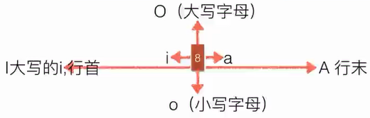

## VIM快速复习

### vi的基本概念

基本上vi可以分为三种状态，分别是
命令模式（command mode)
插入模式（Insert mode)
底行模式（last line mode)

### 按:冒号即可进入last line mode

```
:set nu 列出行号
:set nonu	取消行号
:#7 跳到文件中的第7行
/keyword 查找字符  按n向下
?keyword 查找字符  按N向下
:n1,n2/word1/word2/gc  替换指定范围单词，c表示提示
:w 保存文件
:w filename 以指定的文件名另存
:n1,n2 w [filename]	将 n1 到 n2行另存
:r [filename]	读入另一个文件加到光标所在行后面
:! ls /home  在vi当中察看ls输出信息！
:q离开vi
:wq 和 :ZZ 和 :x 保存并退出vi
!强制执行
:% s/^/#/g 来在全部内容的行首添加 # 号注释
:1,10 s/^/#/g 在1~10 行首添加 # 号注释  
```

### 从command mode进入Insert mode

按i在当前位置编辑
按a在当前位置的下一个字符编辑
按o插入新行，从行首开始编辑
按R(Replace mode)：R会一直取代光标所在的文字，直到按下 ESC为止；(常用)

### 按ESC键退回command mode

h←j↓k↑l→前面加数字移动指定的行数或字符数
1、翻页bu上下整页，ud上下半页

```
ctrl+b：上移一页。
ctrl+f：下移一页。
ctrl+u：上移半页。
ctrl+d：下移半页。
```

2、行定位

```
7gg或7G：定位第7行首字符。(可能只在Vim中有效)
G：移动到文章的最后。
7H:当前屏幕的第7行行首
M：当前屏幕中间行的行首
7L:当前屏幕的倒数第7行行首
```

3、当前行定位

```
$：移动到光标所在行的“行尾”。
0或^：移动到光标所在行的“行首”
w：光标跳到下个单词的开头
e：光标跳到下个单词的字尾
b：光标回到上个单词的开头
```

4、编辑

```
x：剪切当前字符
7x：剪切从当前位置起7个字符
大写的X，表示从前面一个字符开始往前计算
dd：剪切光标所在行。
7dd：从光标所在行开始剪切7行
d7G	删除光标所在到第7行的所有数据
yw：复制当前单词
7yw：复制从当前位置起7个单词
yy：复制当前行
6yy：从当前行起向下复制6行
y7G	复制游标所在列到第7列的所有数据
p：粘贴
u：撤销
ctrl+r：取消撤销
cw：删除当前单词(从光标位置开始计算)，并进入插入模式
c7w：删除7个单词并进入插入模式
```

### 多行编辑，vim支持，vi不支持

按ctrl+V进入块模式，上下键选中快，按大写G选择到末尾，上下左右键移动选择位置
按大写I进去编辑模式，输入要插入的字符，编辑完成按ESC退出
选中要替换的字符后，按c键全部会删除，然后输入要插入的字符，编辑完成按ESC退出
选中要替删除的字符后，按delete键，则会全部删除

按shift+V可进入行模式，对指定行操作

### vim练习

1、创建目录/tmp/test，将/etc/man.config复制到该目录下

```
# mkdir -p /tmp/test

# cp /etc/man.config /tmp/test/

# cd /tmp/test/
```

2、用vim编辑man.config文件：

```
vim man.config
```

3、设置显示行号； 移动到第58行，向右移动40个字符，查看双引号内的是什么目录；

```
：set nu
58G 或58gg 
40-> 或40空格 目录为：/dir/bin/foo 
```

4、移动到第一行，并向下查找“bzip2”这个字符串，它在第几行；

```
移动到最后一行，并向上查找该字符串；
gg 或1G
/bzip 137行 ?bzip2
```

5、将50行到100行之间的man更改为MAN，并且 逐个挑选 是否需要修改；

```
若在挑选过程中一直按y，结果会在最后一行出现改变了几个man?
:50,100s/man/MAN/gc 25次替换
```

6、修改完后，突然反悔了，要全部复原，有哪些方法？

```
一直按u键	
或者
:q!强制不保存退出后，再重新打开该文件
```

7、复制65到73这9行的内容（含有MANPATH_MAP），并且粘贴到最后一行之后；

```
65gg或65G到该行后，9yy,G 移动到最后一行，p粘贴
```

8、21行到42行之间开头为#符号的批注数据不要了，如何删除；

```
21G到该行 22dd
```

9、将这个文件另存为man.test.config的文件

```
:w man.test.config
```

10、到第27行，并且删除15个字符，结果出现的第一个字符是什么？

```
27gg 后15x
```

11、在第一行新增一行，在该行内输入“I am a student ”

```
gg到第一行 O输入即可 说明：o是在当前行之后插入一行，O是在当前行之前插入一行
```

12、保存并退出

```
:wq
```


## 什么是 vim？

Vim是从 vi 发展出来的一个文本编辑器。代码补完、编译及错误跳转等方便编程的功能特别丰富，在程序员中被广泛使用。vim 的官方网站 ([http://www.vim.org](http://www.vim.org/))

vim 键盘图：


------

## vi/vim的三种模式

vi/vim主要分为三种模式，分别是**命令模式（Command mode）**，**输入模式（Insert mode）**和**底线命令模式（Last line mode）**。


 这三种模式的作用分别是：

### 命令模式

用户刚刚启动 vi/vim，便进入了命令模式。 任何时候，不管用户处于何种模式，只要按一下ESC键，即可使Vi进入命令模式； 

此状态下敲击键盘动作会被Vim识别为命令，输入`:` 可切换到**底线命令模式**，以在最底一行输入命令。

若想要编辑文本：启动Vim，进入了命令模式，按下i，切换到输入模式。

### 输入模式

在命令模式下输入插入命令i、附加命令a 、打开命令o、修改命令c、取代命令r或替换命令s都可以进入文本输入模式。在该模式下，用户输入的任何字符都被Vi当做文件内容保存起来，并将其显示在屏幕上。在文本输入过程中，若想回到命令模式下，按键ESC即可。 

### 底行模式

在命令模式下按下:（英文冒号）就进入了底行命令模式。

底线命令模式可以输入单个或多个字符的命令，可用的命令非常多。

在底线命令模式中，基本的命令有（已经省略了冒号）：

- q 退出程序
- w 保存文件

按ESC键可随时退出底线命令模式。


## vim基础操作

### 进入输入模式(Insert mode)

 

- i: 插入光标前一个字符 

- I: 插入行首 

- a: 插入光标后一个字符 

- A: 插入行未 

- o: 向下新开一行,插入行首 

- O: 向上新开一行,插入行首

在进入输入模式后， vi 画面的左下角处会出现『--INSERT--』的字样

### 进入替换模式(Replace mode)

- r : 只会取代光标所在的那一个字符一次
- R: 会一直取代光标所在的文字，直到按下ESC为止

在进入输入模式后， vi 画面的左下角处会出现『--REPLACE--』的字样

### 命令模式下常用命令

####  移动光标

| 移动光标的方法                                     |                                                              |
| :------------------------------------------------- | ------------------------------------------------------------ |
| h 或 向左箭头键(←)                                 | 光标向左移动一个字符                                         |
| j 或 向下箭头键(↓)                                 | 光标向下移动一个字符                                         |
| k 或 向上箭头键(↑)                                 | 光标向上移动一个字符                                         |
| l 或 向右箭头键(→)                                 | 光标向右移动一个字符                                         |
| 向下移动 30 行，可以使用 "30j" 或 "30↓" 的组合按键 |                                                              |
| [Ctrl] + [f]                                       | 屏幕『向下』移动一页，相当于 [Page Down]按键 (常用)          |
| [Ctrl] + [b]                                       | 屏幕『向上』移动一页，相当于 [Page Up] 按键 (常用)           |
| [Ctrl] + [d]                                       | 屏幕『向下』移动半页                                         |
| [Ctrl] + [u]                                       | 屏幕『向上』移动半页                                         |
| +                                                  | 光标移动到非空格符的下一行                                   |
| -                                                  | 光标移动到非空格符的上一行                                   |
| n<space>                                           | <space>表示空格光标向右移动这一行的 n 个字符。例如 20<space> 则光标会向后面移动 20 个字符距离。 |
| 0 或功能键[Home]                                   | 这是数字『 0 』：移动到这一行的最前面字符处 (常用)           |
| $ 或功能键[End]                                    | 移动到这一行的最后面字符处(常用)                             |
| H                                                  | 光标移动到这个屏幕的最上方那一行的第一个字符                 |
| M                                                  | 光标移动到这个屏幕的中央那一行的第一个字符                   |
| L                                                  | 光标移动到这个屏幕的最下方那一行的第一个字符                 |
| G                                                  | 移动到这个文档的最后一行(常用)                               |
| nG                                                 | n 为数字。移动到这个文件的第 n 行。例如 20G 则会移动到这个文件的第 20 行(可配合 :set nu) |
| gg                                                 | 移动到这个文档的第一行，相当于 1G                            |
| n<Enter>                                           | n 为数字。光标向下移动 n 行(常用)                            |

#### 删除操作

| 删除操作 | 删除后会添加到剪切板，相当于剪切                             |
| -------- | ------------------------------------------------------------ |
| x, X     | x为向后删除一个字符 (相当于 [del] 按键)， X为向前删除一个字符(相当于 [backspace] ) |
| nx       | n 为数字，连续向后删除 n 个字符。例如10x表示连续删除 10 个字符。 |
| dd       | 删除光标所在的一整行(常用)                                   |
| ndd      | n 为数字。删除光标所在的向下 n 行，例如 20dd 则是删除 20 行  |
| d1G      | 删除光标所在行到首行的所有数据                               |
| dG       | 删除光标所在行到最后一行的所有数据                           |
| d$       | 删除光标所在位置到该行的最后一个字符                         |
| d0       | 删除光标所在位置到该行的最前面一个字符                       |

#### 撤销&复原&重复

| 撤销&复原 |                                        |
| --------- | -------------------------------------- |
| u         | 撤销操作，相对于普通编辑器里面的ctrl+z |
| Ctrl+r    | 恢复操作，相对于普通编辑器里面的ctrl+y |
| .         | 就是小数点！可重复前一个动作           |

#### 复制&粘贴

| 复制&粘贴 |                                                             |
| --------- | ----------------------------------------------------------- |
| yy        | 复制光标所在行                                              |
| nyy       | n 为数字。复制光标所在的向下 n 行，例如 20yy 则是复制 20 行 |
| y1G       | 复制光标所在行到第一行的所有数据                            |
| yG        | 复制光标所在行到最后一行的所有数据                          |
| y0        | 复制光标所在的那个字符到该行行首的所有数据                  |
| y$        | 复制光标所在的那个字符到该行行尾的所有数据                  |
| p, P      | p 为将已复制的数据在光标下一行贴上，P 则为贴在光标上一行！  |

#### 合成行

- J:  将光标所在行与下一行的数据结合成同一行

#### 搜索

| 搜索  |                                                              |
| :---- | ------------------------------------------------------------ |
| /word | 向光标之下寻找一个名称为 word 的字符串。                     |
| ?word | 向光标之上寻找一个字符串名称为 word 的字符串。               |
| n     | 代表重复前一个搜寻的动作，根据前面输入的/word还是?word向下或向上搜索下一个匹配的字符串。 |
| N     | 表示反向搜索，与n的搜索方向相反。                            |

#### 替换

| 替换                                           |                                                              |
| ---------------------------------------------- | ------------------------------------------------------------ |
| :n1,n2s/word1/word2/g                          | 在第 n1 与 n2 行之间寻找word1并替换为word2！比如『:100,200s/vbird/VBIRD/g』表示在100到200行之间将vbird替换为VBIRD |
| `:1,$s/word1/word2/g` 或 `:%s/word1/word2/g`   | $表示最后一行，%s表示所有行。                                |
| `:1,$s/word1/word2/gc` 或 `:%s/word1/word2/gc` | gc中的c表示取代前显示提示字符给用户确认 (confirm) ！         |

### 底行命令模式的常用操作

| 底行命令模式                                    |                                                              |
| :---------------------------------------------- | ------------------------------------------------------------ |
| :w                                              | 保存编辑数据                                                 |
| :w!                                             | 若文件属性为『只读』时，强制写入该文件。不过，到底能不能写入， 还是跟你对该文件的文件权限有关啊！ |
| :q                                              | 离开 vi                                                      |
| :q!                                             | 若曾修改过文件，又不想储存，使用 ! 为强制离开不储存文件。    |
| 惊叹号 (!) 在 vi 当中，常常具有『强制』的意思～ |                                                              |
| :wq                                             | 储存后离开，若为 :wq! 则为强制储存后离开                     |
| ZZ                                              | 若文件没有更动，则不储存离开，若文件已经被更动过，则储存后离开！ |
| :w [filename]                                   | 另存为                                                       |
| :r [filename]                                   | 将另一个文件『filename』的数据加到光标所在行后面             |
| :n1,n2 w [filename]                             | 将 n1 到 n2 行的内容储存成 filename 这个文件。               |
| :! command                                      | 暂时离开 vi 到指令行模式下执行 command 的显示结果！例如 『:! ls /home』即可在 vi 当中察看 /home 底下以 ls 输出的文件信息！ |
| :set nu                                         | 会在每一行的前缀显示该行的行号                               |
| :set nonu                                       | 取消行号显示                                                 |

示例：

```
将当前路径插入到光标的下一行
:r!pwd
```

### 可视模式

v 进入字符可视化模式： 文本选择是以字符为单位的。 
V 进入行可视化模式： 文本选择是以行为单位的。 
Ctrl+v 进入块可视化模式 ： 选择一个矩形内的文本。 

可视模式下可进行如下操作：

| 可视模式操作 |                                                |
| ------------ | ---------------------------------------------- |
| A            | 在选定的部分后面插入内容                       |
| I            | 在选定的部分前面插入内容                       |
| d            | 删除选定的部分                                 |
| c            | 删除选定的部分并进入插入模式（有批量替换效果） |
| r            | 把选定的部分全部替换为指定的单个字符           |
| `>>`         | 向右缩进一个单位，更适合行可视化模式 |
| `<<`         | 向左缩进一个单位，更适合行可视化模式 |
| `gu` | 选中区域转为小写 |
| `gU` | 选中区域转为大写 |
| `g~` | 大小写互调       |

可视模式下，选中的区域是由两个端点来界定的（一个在左上角，一个在右下角），在默认情况下只可以控制右下角的端点，而使用`o`按键则可以在左上角和右下角之间切换控制端点。 

