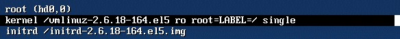

## 单用户模式修改Centos系统root密码

步骤如下：

重启linux系统


3 秒之内要按一下回车，出现如下界面


按向下方向键移动到第二行，按"e"进入编辑模式


在 第二行最后边输入 single，用空格与前面内容隔开


回车



最后按"b"启动，启动后就进入了单用户模式了


进入到单用户模式后，就可以使用passwd命令任意更改root密码了：


## 救援模式修改Ubuntu系统root密码

重启，按住shift键，出现如下界面，选中如下选项


按回车键进入如下界面，然后选中最新的recovery mode选项


按e进入如下界面，找到图中红色框的recovery nomodeset并将其删掉，再在这一行的后面输入

```
quiet splash rw init=/bin/bash
```

 

 

接着按F10或者Ctrl+x 后出现如下界面，在命令行内输入passwd后进行修改密码即可

 

修改完之后重启系统。

## mysql误删root用户的解决方案

干掉所有mysql进程

killall mysqld

跳过权限检查启动mysql服务

mysqld --skip-grant-tables &

此时再进入mysql不需要密码

```
mysql
使用mysql表
mysql>use mysql
插入root用户记录
msyql> insert into table user set user='root',ssl_cipher='',x509_issuer='',x509_subject='',Host='%',select_priv='y', insert_priv='y',update_priv='y',Alter_priv='y',delete_priv='y',create_priv='y',drop_priv='y',reload_priv='y',shutdown_priv='y',Process_priv='y',file_priv='y',grant_priv='y',References_priv='y',index_priv='y', create_user_priv='y',show_db_priv='y',super_priv='y',create_tmp_table_priv='y',Lock_tables_priv='y',execute_priv='y', repl_slave_priv='y',repl_client_priv='y',create_view_priv='y',show_view_priv='y',create_routine_priv='y',alter_routine_priv='y',create_user_priv='y';
mysql>exit  退出mysql数据库

重启数据库
service mysqld restart  
```

修改root密码

```
mysql>update user set Host='%',password=password('123456') where user='root';
刷新用户权限
mysql>flush privileges;
mysql>exit
```

