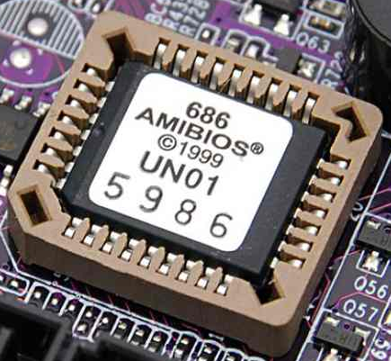
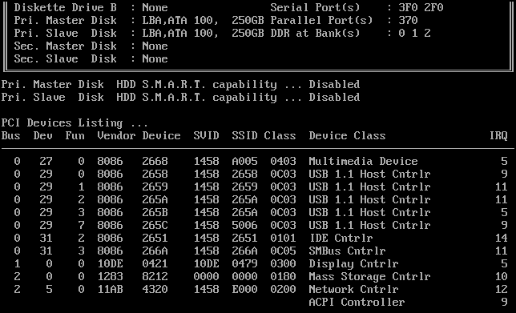
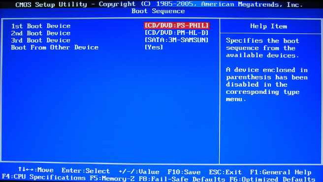
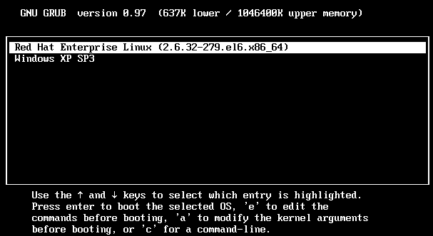
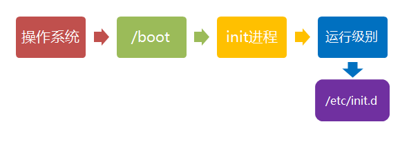
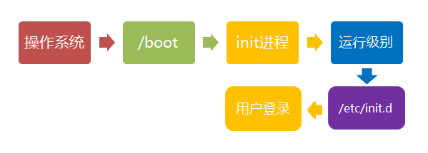
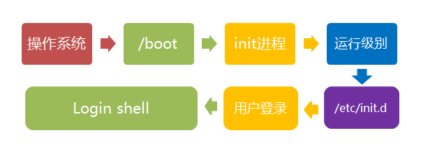

# 计算机启动的流程

  

boot是bootstrap（鞋带）的缩写，它来自一句谚语：

> 　　"pull oneself up by one's bootstraps"

字面意思是"拽着鞋带把自己拉起来"，这当然是不可能的事情。最早的时候，工程师们用它来比喻，计算机启动是一个很矛盾的过程：必须先运行程序，然后计算机才能启动，但是计算机不启动就无法运行程序！

早期真的是这样，必须想尽各种办法，把一小段程序装进内存，然后计算机才能正常运行。所以，工程师们把这个过程叫做"拉鞋带"，久而久之就简称为boot了。

计算机的整个启动过程分成四个阶段。

## 第一阶段：BIOS

上个世纪70年代初，"只读内存"（read-only memory，缩写为ROM）发明，开机程序被刷入ROM芯片，计算机通电后，第一件事就是读取它。

BIOS全称是Basic Input/Output System，即基本输入输出系统，即下图芯片里的程序。

 

### 硬件自检

BIOS程序首先检查，计算机硬件能否满足运行的基本条件，这叫做"硬件自检"（Power-On Self-Test），缩写为[POST](http://en.wikipedia.org/wiki/Power-on_self-test)。

如果硬件出现问题，主板会发出不同含义的[蜂鸣](http://en.wikipedia.org/wiki/Power-on_self-test#Original_IBM_POST_beep_codes)，启动中止。如果没有问题，屏幕就会显示出CPU、内存、硬盘等信息。



### 启动顺序

硬件自检完成后，BIOS把控制权转交给下一阶段的启动程序。

下一阶段的启动程序根据BIOS设置项Boot Sequence（启动顺序）决定，排在前面的设备就是优先转交控制权的设备。



##  **第二阶段：** 主引导记录

BIOS按照"启动顺序"，把控制权转交给排在第一位的储存设备。

这时，计算机读取该设备的第一个扇区，也就是读取最前面的512个字节。如果这512个字节的最后两个字节是0x55和0xAA，表明这个设备可以用于启动；如果不是，表明设备不能用于启动，控制权于是被转交给"启动顺序"中的下一个设备。

这最前面的512个字节，就叫做["主引导记录"](http://en.wikipedia.org/wiki/Master_boot_record)（Master boot record，缩写为MBR）。

### 主引导记录组成

主引导记录由三个部分组成：

> （1） 第1-446字节：调用操作系统的机器码。
>
> （2） 第447-510字节：分区表（Partition table），共64字节。
>
> （3） 第511-512字节：主引导记录签名（0x55和0xAA）。

其中，第二部分"分区表"的作用，是将硬盘分成若干个区。

### 分区表

硬盘分区有很多好处。每个分区可以安装不同的操作系统，"主引导记录"因此必须知道将控制权转交给哪个区。

分区表的长度只有64个字节，里面又分成四项，每项16个字节。所以，一个硬盘最多只能分四个一级分区，又叫做"主分区"。

每个主分区的16个字节，由6个部分组成：

> （1） 第1个字节：如果为0x80，就表示该主分区是激活分区，控制权要转交给这个分区。四个主分区里面只能有一个是激活的。
>
> （2） 第2-4个字节：主分区第一个扇区的物理位置（柱面、磁头、扇区号等等）。
>
> （3） 第5个字节：[主分区类型](http://en.wikipedia.org/wiki/Partition_type)。
>
> （4） 第6-8个字节：主分区最后一个扇区的物理位置。
>
> （5） 第9-12字节：该主分区第一个扇区的逻辑地址。
>
> （6） 第13-16字节：主分区的扇区总数。

最后的四个字节（"主分区的扇区总数"），决定了这个主分区的长度。也就是说，一个主分区的扇区总数最多不超过2的32次方。

如果每个扇区为512个字节，就意味着单个分区最大不超过2TB。再考虑到扇区的逻辑地址也是32位，所以单个硬盘可利用的空间最大也不超过2TB。如果想使用更大的硬盘，只有2个方法：一是提高每个扇区的字节数，二是[增加扇区总数](http://en.wikipedia.org/wiki/GUID_Partition_Table)。

## 第三阶段：硬盘启动

这时，计算机的控制权就要转交给硬盘的某个分区了，这里又分成三种情况。

### 情况A：卷引导记录

上一节提到，四个主分区里面，只有一个是激活的。计算机会读取激活分区的第一个扇区，叫做["卷引导记录](http://en.wikipedia.org/wiki/Volume_Boot_Record)"（Volume boot record，缩写为VBR）。

"卷引导记录"的主要作用是，告诉计算机，操作系统在这个分区里的位置。然后，计算机就会加载操作系统了。

### 情况B：扩展分区和逻辑分区

随着硬盘越来越大，四个主分区已经不够了，需要更多的分区。但是，分区表只有四项，因此规定有且仅有一个区可以被定义成"扩展分区"（Extended partition）。

所谓"扩展分区"，就是指这个区里面又分成多个区。这种分区里面的分区，就叫做"逻辑分区"（logical partition）。

计算机先读取扩展分区的第一个扇区，叫做["扩展引导记录"](http://en.wikipedia.org/wiki/Extended_partition)（Extended boot record，缩写为EBR）。它里面也包含一张64字节的分区表，但是最多只有两项（也就是两个逻辑分区）。

计算机接着读取第二个逻辑分区的第一个扇区，再从里面的分区表中找到第三个逻辑分区的位置，以此类推，直到某个逻辑分区的分区表只包含它自身为止（即只有一个分区项）。因此，扩展分区可以包含无数个逻辑分区。

但是，似乎很少通过这种方式启动操作系统。如果操作系统确实安装在扩展分区，一般采用下一种方式启动。

### 情况C：启动管理器

在这种情况下，计算机读取"主引导记录"前面446字节的机器码之后，不再把控制权转交给某一个分区，而是运行事先安装的["启动管理器"](http://en.wikipedia.org/wiki/Boot_loader#Modern_boot_loaders)（boot loader），由用户选择启动哪一个操作系统。

Linux环境中的启动管理器例如[Grub](http://en.wikipedia.org/wiki/GNU_GRUB)。



## 第四阶段：操作系统

控制权转交给操作系统后，操作系统的内核首先被载入内存。

以Linux系统为例，先载入/boot目录下面的kernel。内核加载成功后，第一个运行的程序是/sbin/init。它根据配置文件（Debian系统是/etc/initab）产生init进程。这是Linux启动后的第一个进程，pid进程编号为1，其他进程都是它的后代。

然后，init线程加载系统的各个模块，比如窗口程序和网络程序，直至执行/bin/login程序，跳出登录界面，等待用户输入用户名和密码。

至此，全部启动过程完成。

# Linux系统启动过程

Linux系统的启动过程可以分为5个阶段：

- 内核的引导。
- 运行 init。
- 系统初始化。
- 建立终端 。
- 用户登录系统。

------

## 加载内核

当计算机打开电源后，首先是BIOS开机自检，按照BIOS中设置的启动设备（通常是硬盘）来启动。

操作系统接管硬件以后，首先读入 /boot 目录下的内核文件。

  

## 启动初始化进程init

 内核文件加载以后，就开始运行第一个程序 /sbin/init，它的作用是初始化系统环境。 

init程序首先是需要读取配置文件/etc/inittab。

> CentOS 各版本init配置文件的位置：
>
> - **SysV:** init, CentOS 5之前, 配置文件： /etc/inittab。
> - **Upstart:** init,CentOS 6, 配置文件： /etc/inittab, /etc/init/*.conf。
> - **Systemd：** systemd, CentOS 7,配置文件： /usr/lib/systemd/system、 /etc/systemd/system。


 由于init是第一个运行的程序，它的进程编号（pid）就是1。其他所有进程都从它衍生，都是它的子进程。 

## 确定运行级别

许多程序需要开机启动。它们在Windows叫做"服务"（service），在Linux就叫做"守护进程"（daemon）。

init进程的一大任务，就是去运行这些开机启动的程序。

但是，不同的场合需要启动不同的程序，比如用作服务器时，需要启动Apache，用作桌面就不需要。

Linux允许为不同的场合，分配不同的开机启动程序，这就叫做"运行级别"（runlevel）。也就是说，启动时根据"运行级别"，确定要运行哪些程序。


Linux系统有7个运行级别(runlevel)：

- 运行级别0：系统停机状态，系统默认运行级别不能设为0，否则不能正常启动
- 运行级别1：单用户工作状态，root权限，用于系统维护，禁止远程登陆
- 运行级别2：多用户状态(没有NFS)
- 运行级别3：完全的多用户状态(有NFS)，登陆后进入控制台命令行模式
- 运行级别4：系统未使用，保留
- 运行级别5：X11控制台，登陆后进入图形GUI模式
- 运行级别6：系统正常关闭并重启，默认运行级别不能设为6，否则不能正常启动

可以使用运行级别执行关机或重启：

```
init 0	关机
init 6	重启
```

## 加载开机启动程序

在init的配置文件中有这么一行： `si::sysinit:/etc/rc.d/rc.sysinit`它调用执行了/etc/rc.d/rc.sysinit，而rc.sysinit是一个bash shell的脚本，它主要是完成一些系统初始化的工作，rc.sysinit是每一个运行级别都要首先运行的重要脚本。

它主要完成的工作有：激活交换分区，检查磁盘，加载硬件模块以及其它一些需要优先执行任务。

```
l5:5:wait:/etc/rc.d/rc 5
```

这一行表示以5为参数运行/etc/rc.d/rc，/etc/rc.d/rc是一个Shell脚本，它接受5作为参数，去执行/etc/rc.d/rc5.d/目录下的所有的rc启动脚本，/etc/rc.d/rc5.d/目录中的这些启动脚本实际上都是一些连接文件，而不是真正的rc启动脚本，真正的rc启动脚本实际上都是放在/etc/rc.d/init.d/目录下。

而这些rc启动脚本有着类似的用法，它们一般能接受start、stop、restart、status等参数。

/etc/rc.d/rc5.d/中的rc启动脚本通常是K或S开头的连接文件，对于以 S 开头的启动脚本，将以start参数来运行。

而如果发现存在相应的脚本也存在K打头的连接，而且已经处于运行态了(以/var/lock/subsys/下的文件作为标志)，则将首先以stop为参数停止这些已经启动了的守护进程，然后再重新运行。

这样做是为了保证是当init改变运行级别时，所有相关的守护进程都将重启。

至于在每个运行级中将运行哪些守护进程，用户可以通过chkconfig或setup中的"System Services"来自行设定。



##  用户登录

一般来说，用户的登录方式有三种：

- （1）命令行登录
- （2）ssh登录
- （3）图形界面登录



对于运行级别为5的图形方式用户来说，他们的登录是通过一个图形化的登录界面。登录成功后可以直接进入 KDE、Gnome 等窗口管理器。

而本文主要讲的还是文本方式登录的情况：当我们看到mingetty的登录界面时，我们就可以输入用户名和密码来登录系统了。

Linux 的账号验证程序是login，login会接收mingetty传来的用户名作为用户名参数。

然后login会对用户名进行分析：如果用户名不是root，且存在 /etc/nologin 文件，login 将输出 nologin 文件的内容，然后退出。

这通常用来系统维护时防止非root用户登录。只有/etc/securetty中登记了的终端才允许 root 用户登录，如果不存在这个文件，则root用户可以在任何终端上登录。

/etc/usertty文件用于对用户作出附加访问限制，如果不存在这个文件，则没有其他限制。

## 图形模式与文字模式的切换方式

Linux预设提供了六个命令窗口终端机让我们来登录。

默认我们登录的就是第一个窗口，也就是tty1，这个六个窗口分别为tty1,tty2 … tty6，你可以按下Ctrl + Alt + F1 ~ F6 来切换它们。

如果你安装了图形界面，默认情况下是进入图形界面的，此时你就可以按Ctrl + Alt + F1 ~ F6来进入其中一个命令窗口界面。

当你进入命令窗口界面后再返回图形界面只要按下Ctrl + Alt + F7 就回来了。

如果你用的vmware 虚拟机，命令窗口切换的快捷键为 Alt + Space + F1~F6. 如果你在图形界面下请按Alt + Shift + Ctrl + F1~F6 切换至命令窗口。

## login shell



shell，简单说就是命令行界面，让用户可以直接与操作系统对话。用户登录时打开的shell，就叫做login shell。 

（1）命令行登录：首先读入 /etc/profile，这是对所有用户都有效的配置；然后依次寻找下面三个文件，这是针对当前用户的配置。

> ```bash
> ~/.bash_profile
> ~/.bash_login
> ~/.profile
> ```

需要注意的是，这三个文件只要有一个存在，就不再读入后面的文件了。比如，要是 ~/.bash_profile 存在，就不会再读入后面两个文件了。

（2）ssh登录：与第一种情况完全相同。

（3）图形界面登录：只加载 /etc/profile 和 ~/.profile。也就是说，~/.bash_profile 不管有没有，都不会运行。

## Linux关机

```
sync 将数据由内存同步到硬盘中。

shutdown 关机指令，你可以man shutdown 来看一下帮助文档。例如你可以运行如下命令关机：

shutdown –h 10 'This server will shutdown after 10 mins' 计算机将在10分钟后关机，并且显示信息在登陆用户的当前屏幕中。

shutdown –h now 立马关机

shutdown –h 20:25 系统会在今天20:25关机

shutdown –h +10 十分钟后关机

shutdown –r now 系统立马重启

shutdown –r +10 系统十分钟后重启

reboot 就是重启，等同于 shutdown –r now

halt 关闭系统，等同于shutdown –h now 和 poweroff
```

最后总结一下，不管是重启系统还是关闭系统，首先要运行**sync**命令，把内存中的数据写到磁盘中。

关机的命令有 **shutdown –h now halt poweroff** 和 **init 0** , 重启系统的命令有 **shutdown –r now reboot init 6**。