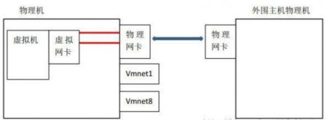
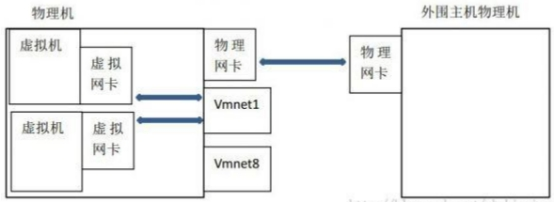
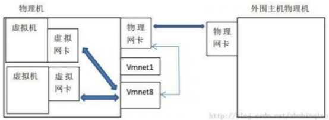
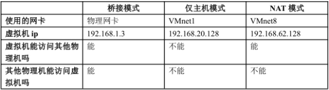

## 虚拟机的三种网络模式

**桥接**

在网络网卡上安装了一个桥接协议，让这块网卡处于混杂模式，可以同时连接多个网络的做法。

桥接下，类似于把物理主机虚拟为一个交换机，所有桥接设置的虚拟机连接到这个交换机的一个接口上，物理主机也同样查在这个交换机当中，所以所有桥接下网卡与网卡都是交换模式的，相互可以访问而不干扰。

 

**Host-only**（仅与主机通信）

虚拟机使用VMnet1网卡与主机单独组网,主机对于虚拟机相当于路由器

 

**NAT**

虚拟机使用VMnet8网卡与主机单独组网,主机对于虚拟机相当于路由器，VMnet8网卡通过NAT地址转换协议与物理机网卡通信

 

 

## 虚拟机常见问题

### 修改静态地址后发现无法ping外网

```
需要设置网关
route add default gw 192.168.33.1
添加nameserver
vi /etc/resolv.conf
nameserver 192.168.33.1
```

### 虚拟机克隆后eth0消失

```
直接修改  /etc/sysconfig/network-script/ifcfg-eth0
删掉UUID  HWADDR
配置静态地址
然后：
rm -rf 　/etc/udev/rules.d/70-persistent-net.rules
然后 reboot
```


## SecureCRT_FX

**初始设置**

更改crt颜色
选项 --> 常规 --> 默认会话 --> 编辑默认配置 --> 终端 --> 仿真 --> 终端 改为linux 
更改字符集
选项 --> 常规 --> 默认会话 --> 编辑默认配置 --> 终端 --> 字符编码 设置为UTF-8

**CRT中文乱码问题**

进入SecureCRT_FX_7.0\Data\Settings\Config\Sessions
找到对应主机的配置文件
找到245行 D:"Filenames Always Use UTF8"=00000000改为D:"Filenames Always Use UTF8"=00000001

